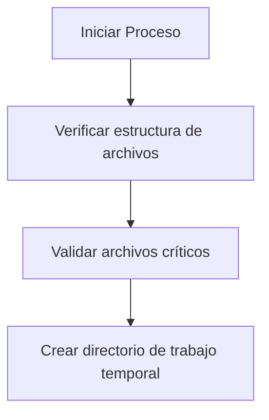
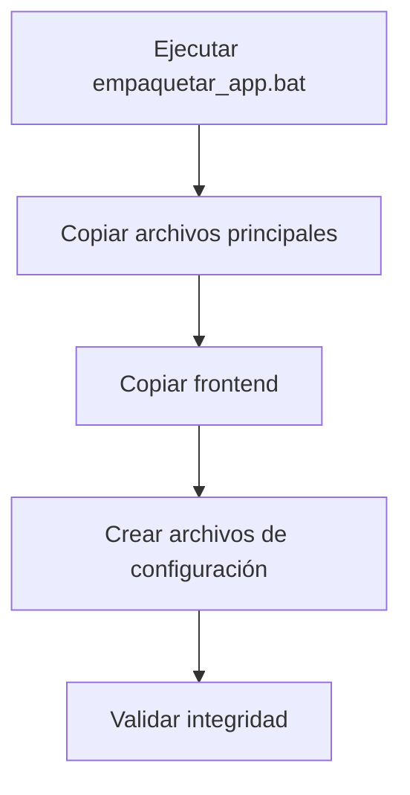
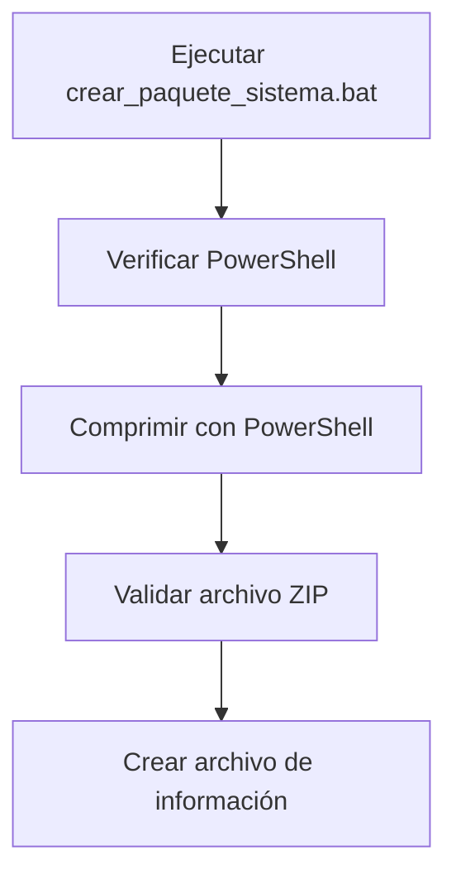
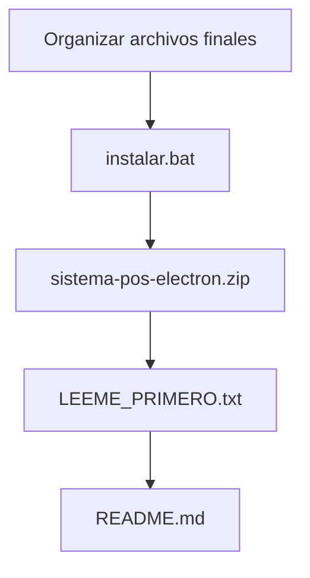
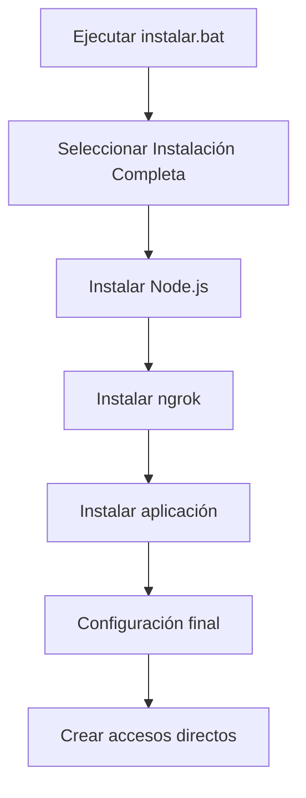
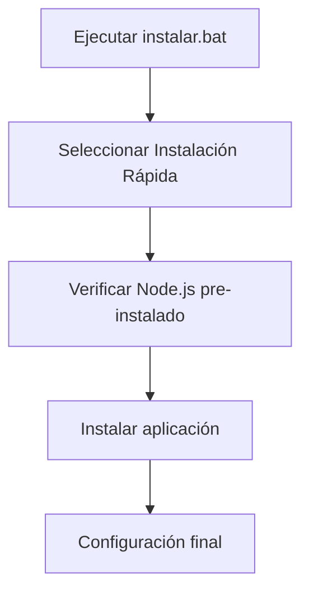
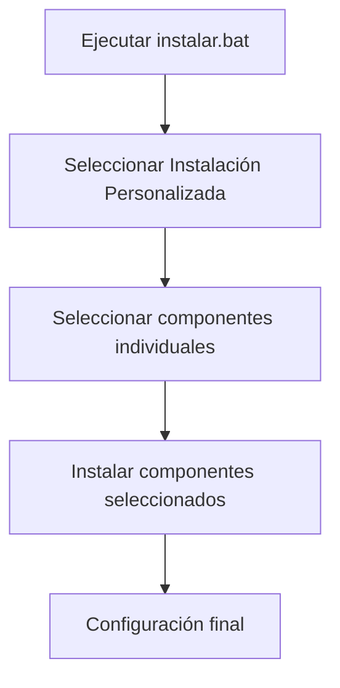

# 📦 Plan de Compresión, Exportación e Instalación del Sistema POS

## 🎯 Objetivo
Crear un proceso automatizado para comprimir, exportar e instalar el Sistema POS en nuevos equipos, asegurando una implementación consistente y confiable.

## 📋 Componentes Identificados para Exportación

### 1. **Aplicación Principal**
- `excluded/alternatives/sistema-Pos-Electron/` - Aplicación Electron completa
- `main.js` - Archivo principal de la aplicación
- `package.json` - Configuración y dependencias
- `sysdata.dat` - Datos de licencia y configuración
- `frontend/` - Interfaz de usuario completa

### 2. **Instalador y Utilidades**
- `excluded/installer/instalador Punto de venta/instalar.bat` - Script principal de instalación
- `excluded/installer/instalador Punto de venta/crear_paquete_sistema.bat` - Script para crear paquetes
- `excluded/installer/instalador Punto de venta/aplicacion/empaquetar_app.bat` - Script para empaquetar aplicación
- `excluded/installer/instalador Punto de venta/instaladores/` - Scripts de instalación de componentes

### 3. **Documentación**
- `excluded/installer/instalador Punto de venta/README.md` - Documentación completa
- `excluded/installer/instalador Punto de venta/LEEME_PRIMERO.txt` - Guía rápida

## 🔧 Proceso de Compresión y Exportación

### Paso 1: Preparación del Entorno


### Paso 2: Empaquetado de la Aplicación


### Paso 3: Creación del Paquete Comprimido


### Paso 4: Preparación para Distribución


## 🚀 Proceso de Instalación en Sistema Destino

### Opción 1: Instalación Completa (Recomendada)


### Opción 2: Instalación Rápida


### Opción 3: Instalación Personalizada


## 📋 Requisitos del Sistema

### Mínimos
- Sistema Operativo: Windows 7 SP1 o superior
- Procesador: 1 GHz o superior
- Memoria RAM: 1 GB
- Espacio en disco: 1 GB libre
- Conexión a internet (para instalación inicial)

### Recomendados
- Sistema Operativo: Windows 10 o superior
- Procesador: 2 GHz dual-core
- Memoria RAM: 2 GB
- Espacio en disco: 2 GB libres
- Cámara web (para escaneo de códigos)

## 🔐 Credenciales por Defecto
- **Usuario**: admin
- **Contraseña**: pos123

## 📦 Contenido del Paquete Final

```
📁 Paquete de Distribución/
├── 📄 instalar.bat                 # Script principal de instalación
├── 📄 sistema-pos-electron.zip     # Sistema comprimido
├── 📄 LEEME_PRIMERO.txt           # Guía rápida
└── 📄 README.md                   # Documentación completa
```

## 🎯 Pasos para Crear el Paquete de Distribución

1. **Ejecutar el script de empaquetado**:
   ```bash
   # Navegar al directorio del instalador
   cd excluded/installer/instalador Punto de venta

   # Ejecutar el script de empaquetado de la aplicación
   aplicacion/empaquetar_app.bat

   # Ejecutar el script de creación del paquete
   crear_paquete_sistema.bat
   ```

2. **Verificar archivos generados**:
   - `paquetes/sistema-pos-electron.zip` - Paquete comprimido del sistema
   - `paquetes/paquete_info.txt` - Información del paquete

3. **Preparar archivos para distribución**:
   - Copiar `instalar.bat` al directorio de distribución
   - Copiar `sistema-pos-electron.zip` al directorio de distribución
   - Incluir `LEEME_PRIMERO.txt` y `README.md` (opcional)

## 📋 Proceso de Instalación en Equipo Destino

1. **Preparar archivos**:
   - Asegurarse de tener ambos archivos en la misma carpeta:
     - `instalar.bat`
     - `sistema-pos-electron.zip`

2. **Ejecutar instalador**:
   ```bash
   # Hacer doble clic en instalar.bat
   # O ejecutar desde línea de comandos:
   instalar.bat
   ```

3. **Seguir asistente**:
   - El instalador automáticamente:
     1. Descomprime el paquete del sistema
     2. Verifica requisitos del sistema
     3. Descarga e instala Node.js (si es necesario)
     4. Descarga e instala ngrok (si es necesario)
     5. Instala dependencias de la aplicación
     6. Configura el sistema completamente
     7. Crea accesos directos

## 🆘 Solución de Problemas

### Error: "Node.js no encontrado"
```bash
# Ejecutar instalador de Node.js manualmente
cd instaladores
instalar_nodejs.bat
```

### Error: "ngrok no configurado"
```bash
# Configurar ngrok manualmente
cd instaladores
configurar_ngrok.bat
```

### Error: "Puerto ocupado"
- Cerrar otras aplicaciones que usen el puerto 3000
- O configurar un puerto diferente en la aplicación

## 📈 Validación del Proceso

1. **Pruebas de compresión**:
   - Verificar que el archivo ZIP se crea correctamente
   - Validar que contiene todos los archivos necesarios
   - Confirmar que el tamaño es razonable

2. **Pruebas de instalación**:
   - Probar en un equipo limpio con Windows 7
   - Probar en un equipo con Windows 10/11
   - Verificar que todos los componentes se instalan correctamente
   - Confirmar que la aplicación funciona correctamente

3. **Pruebas de funcionalidad**:
   - Verificar inicio de sesión con credenciales por defecto
   - Probar funcionalidades básicas del sistema
   - Validar conexión a base de datos
   - Confirmar acceso a utilidades

## 📝 Documentación Adicional

- **Guía del Usuario**: Incluida en `README.md`
- **Manual Técnico**: Detalles de configuración avanzada
- **FAQ**: Preguntas frecuentes y soluciones

## 🎉 Proceso Completado

Después de seguir este plan, el Sistema POS estará completamente funcional con:
- ✅ Interfaz intuitiva y moderna
- ✅ Base de datos con datos de ejemplo
- ✅ Funcionalidades completas activas
- ✅ Documentación incluida
- ✅ Soporte disponible

**¡El Sistema POS está listo para revolucionar la gestión de negocios!** 🚀