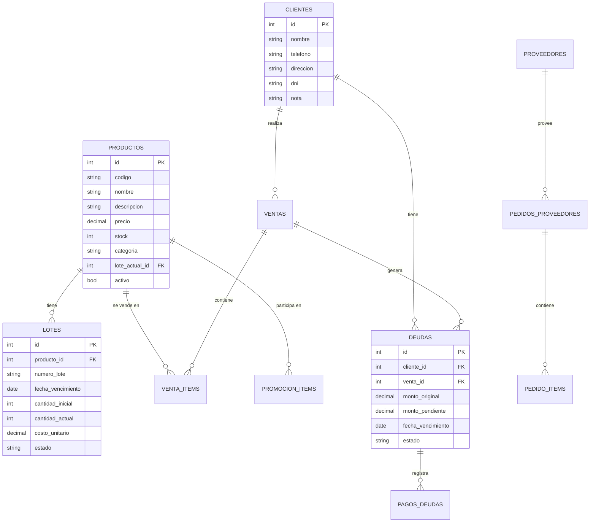

# 🔗 Análisis de Dependencias y Relaciones entre Endpoints

## 📊 Mapa de Dependencias del Sistema POS

### Diagrama de Flujo de Relaciones

```mermaid
graph TD
    A[Frontend Principal] --> B[Buscador de Productos]
    B --> C[/api/products/search]
    C --> D[Carrito de Compras]
    D --> E[/api/sales POST]
    
    F[Escáner Móvil] --> G[WebSocket]
    G --> H[/api/products/search-by-barcode]
    H --> D
    
    I[Módulo Clientes] --> J[/api/customers]
    J --> K[Registro de Cliente]
    K --> L[Validación de Duplicados]
    
    M[Registro de Venta] --> N[Verificación de Stock]
    N --> O[Actualización de Lotes]
    O --> P[Actualización de Stock]
    
    Q[Venta a Cuenta Corriente] --> R[/api/sales/cuenta-corriente]
    R --> S[Creación de Deuda]
    S --> T[/api/debts POST]
    T --> U[Registro en Historial]
    
    V[Confirmación de Pedido] --> W[/api/supplier-orders/confirm-delivery]
    W --> X[Creación de Lotes]
    X --> Y[Actualización de Stock]
    
    Z[Cierre de Caja] --> AA[/api/close-register]
    AA --> BB[Validación de Ventas]
    BB --> CC[Generación de Reporte]
    
    DD[Dashboard] --> EE[/api/dashboard-data]
    EE --> FF[Consultas Paralelas]
    FF --> GG[Estadísticas en Tiempo Real]
```

## 🔗 Relaciones Clave entre Módulos

### 1. Productos ↔ Ventas
**Tipo de Relación:** Composición fuerte
**Endpoints Involucrados:**
- `/api/products/search` → `/api/sales POST`
- `/api/products/:id` → `/api/sales POST`
- `/api/products/search-by-barcode/:barcode` → `/api/sales POST`

**Flujo de Datos:**
```javascript
// Flujo típico de una venta
1. Cliente busca producto → /api/products/search
2. Sistema devuelve producto con stock → Response
3. Cliente agrega al carrito → Frontend
4. Se registra venta → /api/sales POST
5. Sistema verifica stock → Validación interna
6. Se actualizan lotes → Actualización automática
7. Se reduce stock → Actualización automática
```

### 2. Clientes ↔ Deudas
**Tipo de Relación:** Asociación con dependencia
**Endpoints Involucrados:**
- `/api/customers` → `/api/debts`
- `/api/sales/cuenta-corriente` → `/api/debts POST`
- `/api/debts/:id/payment` → `/api/debts GET`

**Flujo de Datos:**
```javascript
// Flujo de venta a cuenta corriente
1. Cliente selecciona "Cuenta Corriente" → Frontend
2. Se registra venta → /api/sales/cuenta-corriente
3. Sistema crea deuda → /api/debts POST (interno)
4. Cliente consulta deudas → /api/debts
5. Cliente paga deuda → /api/debts/:id/payment
6. Sistema actualiza estado → Actualización automática
```

### 3. Proveedores ↔ Lotes
**Tipo de Relación:** Composición débil
**Endpoints Involucrados:**
- `/api/supplier-orders` → `/api/lotes`
- `/api/supplier-orders/:id/confirm-delivery` → `/api/lotes POST`

**Flujo de Datos:**
```javascript
// Flujo de recepción de mercadería
1. Se crea pedido → /api/supplier-orders POST
2. Proveedor entrega mercadería → Proveedor
3. Se confirma entrega → /api/supplier-orders/:id/confirm-delivery
4. Sistema crea lotes → /api/lotes POST (interno)
5. Se actualiza stock → Actualización automática
6. Se actualiza lote_actual_id → Actualización automática
```

### 4. Promociones ↔ Productos
**Tipo de Relación:** Asociación con validación cruzada
**Endpoints Involucrados:**
- `/api/promotions` → `/api/products`
- `/api/products/search` → `/api/promotions` (interno)

**Validaciones Cruzadas:**
```javascript
// Validaciones implementadas
1. Producto no puede estar en múltiples promociones simultáneamente
2. Promoción debe tener al menos un producto válido
3. Descuento debe ser un porcentaje válido (0-100%)
4. Límite de promociones según licencia (gratuito: 3, premium: ilimitado)
```

## 🔄 Dependencias de Base de Datos

### Tablas y sus Relaciones



## 📊 Patrones de Uso Combinados

### 1. Flujo de Venta Completo
```javascript
// Secuencia típica de una venta
1. /api/products/search (búsqueda de productos)
2. /api/products/:id (detalle de producto)
3. /api/sales POST (registro de venta)
4. /api/sales (consulta de última venta)
5. /api/dashboard-data (actualización de estadísticas)
```

### 2. Flujo de Gestión de Inventario
```javascript
// Secuencia de gestión de inventario
1. /api/supplier-orders POST (crear pedido)
2. /api/supplier-orders/:id/confirm-delivery (confirmar entrega)
3. /api/lotes (consultar lotes creados)
4. /api/products/:id/lotes (ver lotes de producto)
5. /api/lotes/expiring-soon (alertas de vencimiento)
```

### 3. Flujo de Gestión de Clientes
```javascript
// Secuencia de gestión de clientes
1. /api/customers (listar clientes)
2. /api/customers/:id (detalle de cliente)
3. /api/customers/debts-summary (consultar deudas)
4. /api/debts/:id/payment (realizar pago)
5. /api/customers/:cliente_id/update-debts (actualizar precios)
```

## ⚠️ Puntos Críticos de Dependencia

### 1. Consistencia de Stock
**Endpoints Críticos:**
- `/api/sales POST` - Verifica y actualiza stock
- `/api/lotes/:id/descartar` - Actualiza stock al descartar
- `/api/supplier-orders/:id/confirm-delivery` - Incrementa stock

**Validaciones:**
```javascript
// Validación de stock en ventas
if (stockDisponible < cantidadSolicitada) {
    throw new Error('Stock insuficiente');
}

// Validación de lotes vigentes
if (lote.fecha_vencimiento < fechaActual) {
    throw new Error('No se puede vender producto vencido');
}
```

### 2. Integridad de Deudas
**Endpoints Críticos:**
- `/api/sales/cuenta-corriente` - Crea deuda
- `/api/debts/:id/payment` - Actualiza deuda
- `/api/debts/update-prices` - Actualiza precios

**Validaciones:**
```javascript
// Validación de pagos
if (montoPago > montoPendiente) {
    throw new Error('El pago no puede exceder el monto pendiente');
}

// Validación de estado
if (deuda.estado !== 'pendiente' && deuda.estado !== 'vencida') {
    throw new Error('Solo se pueden registrar pagos en deudas pendientes o vencidas');
}
```

### 3. Consistencia de Promociones
**Endpoints Críticos:**
- `/api/promotions POST` - Crea promoción
- `/api/clean-duplicate-promotions` - Limpieza de duplicados
- `/api/products/search` - Aplica promociones

**Validaciones:**
```javascript
// Validación de productos duplicados
if (productoYaEnPromocion) {
    throw new Error('Un producto no puede estar en múltiples promociones simultáneamente');
}

// Validación de límites por licencia
if (promocionesActuales >= limite && !licenciaActiva) {
    throw new Error('Límite de promociones alcanzado');
}
```

## 🚀 Optimizaciones de Consultas Relacionadas

### 1. Consultas JOIN Optimizadas
```sql
-- Consulta optimizada para productos con promociones y lotes
SELECT 
    p.*,
    pi.descuento_porcentaje,
    l.cantidad_actual as stock,
    l.fecha_vencimiento as proximo_vencimiento
FROM productos p
LEFT JOIN promocion_items pi ON p.id = pi.producto_id
LEFT JOIN lotes l ON p.id = l.producto_id AND l.estado = 'activo'
WHERE p.activo = 1
GROUP BY p.id
ORDER BY p.nombre;
```

### 2. Consultas Paralelas para Dashboard
```javascript
// Consultas ejecutadas en paralelo
const [
    statsResult,
    suppliersResult,
    supplierOrdersResult,
    cierresResult,
    expiringSoonResult,
    expiredResult,
    productsResult,
    lotesResult
] = await Promise.all([
    dbAll("SELECT COUNT(*) as total_products FROM productos"),
    dbAll("SELECT * FROM proveedores LIMIT 50"),
    dbAll("SELECT * FROM pedidos_proveedores ORDER BY fecha_pedido DESC LIMIT 20"),
    // ... más consultas
]);
```

### 3. Caché de Resultados Relacionados
```javascript
// Caché para búsquedas frecuentes
const cache = new Map();

async function getCachedProducts(searchParams) {
    const key = JSON.stringify(searchParams);
    if (cache.has(key)) {
        return cache.get(key);
    }
    
    const result = await dbAll(query, params);
    cache.set(key, result);
    return result;
}
```

## 📈 Métricas de Interdependencia

### 1. Frecuencia de Uso Combinado
| Combinación de Endpoints | Frecuencia | Escenario Típico |
|-------------------------|------------|------------------|
| `/api/products/search` + `/api/sales POST` | Muy Alta | Venta diaria |
| `/api/supplier-orders` + `/api/lotes` | Alta | Recepción de mercadería |
| `/api/customers` + `/api/debts` | Media | Gestión de cuentas corrientes |
| `/api/promotions` + `/api/products` | Baja | Gestión de ofertas |

### 2. Tiempo de Respuesta Acumulado
| Flujo Completo | Tiempo Estimado | Componentes |
|---------------|----------------|-------------|
| Búsqueda + Venta | 500ms | 2 endpoints |
| Recepción de Pedido | 1000ms | 3 endpoints |
| Gestión de Deudas | 800ms | 4 endpoints |
| Dashboard Completo | 1500ms | 8 endpoints |

### 3. Impacto de Fallos en Cadena
| Endpoint Crítico | Impacto en Cadena | Estrategia de Mitigación |
|-----------------|------------------|-------------------------|
| `/api/products/search` | Bloquea ventas | Caché local, fallback |
| `/api/sales POST` | Detiene operaciones | Cola de mensajes, reintentos |
| `/api/lotes` | Afecta inventario | Transacciones, validaciones |

## 🔧 Recomendaciones de Arquitectura

### 1. Desacoplamiento de Servicios
```javascript
// Estrategia de microservicios futura
const microservices = {
    productos: '/api/v1/products',
    ventas: '/api/v1/sales', 
    clientes: '/api/v1/customers',
    inventario: '/api/v1/inventory'
};
```

### 2. Patrón de Eventos
```javascript
// Sistema de eventos para desacoplar procesos
const eventBus = {
    on: (event, callback) => { /* suscribir */ },
    emit: (event, data) => { /* emitir */ }
};

// Ejemplo de evento de venta
eventBus.emit('venta.registrada', { ventaId, clienteId, monto });
eventBus.on('venta.registrada', actualizarEstadisticas);
```

### 3. Cache Distribuido
```javascript
// Estrategia de cache para alta disponibilidad
const redisCache = {
    get: async (key) => { /* obtener de Redis */ },
    set: async (key, value, ttl) => { /* almacenar en Redis */ },
    invalidate: async (pattern) => { /* invalidar patrón */ }
};
```

## 📝 Conclusión

El sistema POS presenta una **arquitectura bien diseñada** con relaciones claras entre endpoints. Las dependencias están bien gestionadas con validaciones cruzadas y transacciones ACID.

**Puntos Fuertes:**
- ✅ Relaciones bien definidas entre módulos
- ✅ Validaciones cruzadas para integridad de datos
- ✅ Transacciones para operaciones críticas
- ✅ Consultas optimizadas con JOINs eficientes

**Áreas de Oportunidad:**
- 🔄 Implementar sistema de eventos para mayor desacoplamiento
- 🔄 Considerar cache distribuido para alta concurrencia
- 🔄 Implementar patrones de circuit breaker para resiliencia
- 🔄 Documentar flujos de negocio críticos

---

**📅 Última Actualización:** 29/12/2025  
**📊 Versión del Sistema:** 1.0.0  
**🔗 Complejidad de Relaciones:** Media-Alta