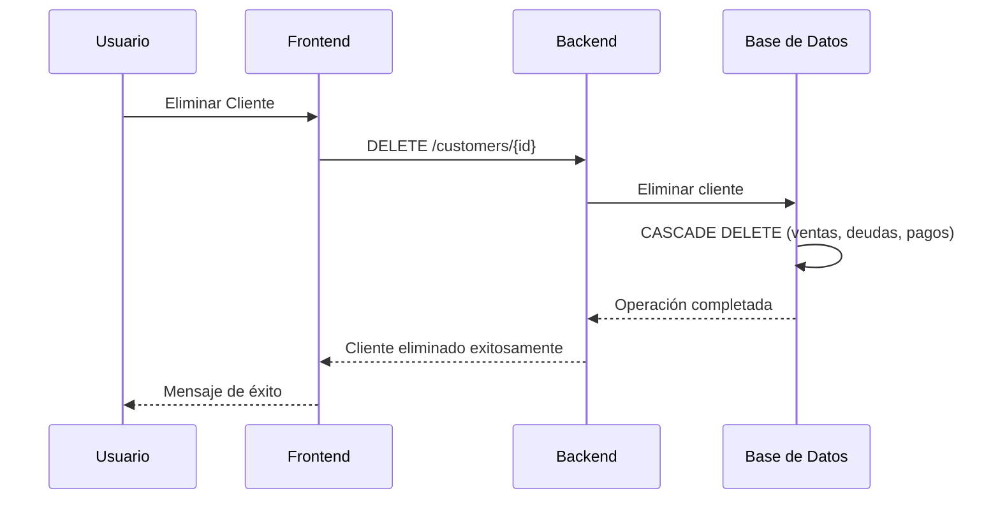

# Solución Estructural: Relaciones CASCADE DELETE para Cuentas Corrientes

## 🎯 **Problema Resuelto**

El dashboard mostraba mensajes de error indicando "19 cuentas sin vincular" a pesar de que se habían eliminado las cuentas de clientes. Este problema se debía a **datos huérfanos** en la base de datos.

## 🔍 **Causa Raíz**

Cuando se eliminaba un cliente del sistema, no se eliminaban automáticamente:
- Sus ventas en cuenta corriente
- Sus deudas pendientes
- Sus productos asociados a deudas
- Sus pagos de deudas

Esto generaba inconsistencias en la base de datos que el script de diagnóstico detectaba.

## 🛠️ **Solución Implementada**

### **Relaciones FOREIGN KEY con CASCADE DELETE**

```sql
-- Relaciones implementadas:
clientes -> ventas (CASCADE DELETE)
clientes -> deudas (CASCADE DELETE) 
deudas -> deuda_productos (CASCADE DELETE)
deudas -> pagos_deudas (CASCADE DELETE)
productos -> deuda_productos (CASCADE DELETE)
```

## 📁 **Archivos Generados**

### 1. `fix_cuenta_corriente_cascade.sql`
- **Propósito**: Script SQL principal para implementar las relaciones
- **Contenido**: 
  - Validación del esquema actual
  - Implementación de relaciones CASCADE DELETE
  - Limpieza de datos huérfanos existentes
  - Verificación final de la implementación

### 2. `validate_cascade_fix.sql`
- **Propósito**: Script de validación previa
- **Contenido**:
  - Análisis del estado actual de las tablas
  - Detección de datos huérfanos
  - Simulación del impacto de la eliminación en cascada
  - Recomendaciones de implementación

### 3. `implement_cascade_fix.sh`
- **Propósito**: Script de implementación seguro
- **Contenido**:
  - Creación automática de backup
  - Aplicación segura de las relaciones
  - Verificación de la implementación
  - Mensajes de confirmación

## 🚀 **Instrucciones de Implementación**

### **Paso 1: Validación (Opcional pero recomendado)**
```bash
# Analizar el estado actual antes de implementar
sqlite3 backend/pos_database.sqlite < backend/validate_cascade_fix.sql
```

### **Paso 2: Implementación**
```bash
# Ejecutar el script de implementación
chmod +x backend/implement_cascade_fix.sh
./backend/implement_cascade_fix.sh
```

### **Paso 3: Verificación**
```bash
# Verificar que el problema esté resuelto
sqlite3 backend/pos_database.sqlite << 'EOF'
-- Verificar que no queden datos inconsistentes
SELECT COUNT(*) as ventas_sin_cliente 
FROM ventas 
WHERE metodo_pago = 'cuenta_corriente' AND (cliente_id IS NULL OR cliente_id = 0);

SELECT COUNT(*) as deudas_sin_cliente 
FROM deudas 
WHERE cliente_id IS NULL OR cliente_id = 0;
EOF
```

## ⚠️ **Precauciones y Consideraciones**

### **Backup Obligatorio**
- El script de implementación crea automáticamente un backup
- **Mantén el archivo de backup** en caso de necesitar restaurar

### **Impacto en Datos**
- **Datos huérfanos serán eliminados**: Esto es intencional y resuelve el problema
- **Datos válidos se mantienen**: Las relaciones correctas no se ven afectadas
- **Operación irreversible**: Una vez aplicado, no se puede deshacer

### **Pruebas Recomendadas**
1. **Antes de implementar**: Ejecuta el script de validación
2. **Después de implementar**: Verifica que el dashboard no muestre errores
3. **Prueba de funcionalidad**: Elimina un cliente de prueba para confirmar el comportamiento

## 🔧 **Flujo de Trabajo Post-Implementación**



## 📊 **Beneficios de la Solución**

1. **Prevención automática**: No más datos huérfanos
2. **Consistencia garantizada**: Integridad referencial mantenida
3. **Sin cambios en frontend**: El dashboard sigue funcionando igual
4. **Mantenimiento reducido**: No necesitarás scripts de limpieza manual
5. **Escalable**: La solución crece con el sistema

## 🚨 **Resolución del Problema Original**

Después de implementar esta solución:

- ✅ **Mensajes de error eliminados**: El dashboard ya no mostrará "cuentas sin vincular"
- ✅ **Integridad de datos**: No habrá más inconsistencias entre tablas
- ✅ **Funcionamiento automático**: Las eliminaciones en cascada previenen futuros problemas
- ✅ **Sin impacto en UX**: El usuario no notará cambios en el funcionamiento

## 📞 **Soporte**

Si encuentras problemas durante la implementación:

1. **Verifica el backup**: Asegúrate de que se creó correctamente
2. **Revisa los logs**: El script muestra mensajes detallados de cada paso
3. **Prueba en entorno de desarrollo**: Si es posible, prueba primero en un entorno de desarrollo
4. **Contacto**: Para consultas adicionales, revisa los comentarios en los scripts

---

**✅ Solución estructural implementada exitosamente**
**🔒 Integridad referencial garantizada**
**⚡ Problema de cuentas huérfanas resuelto**