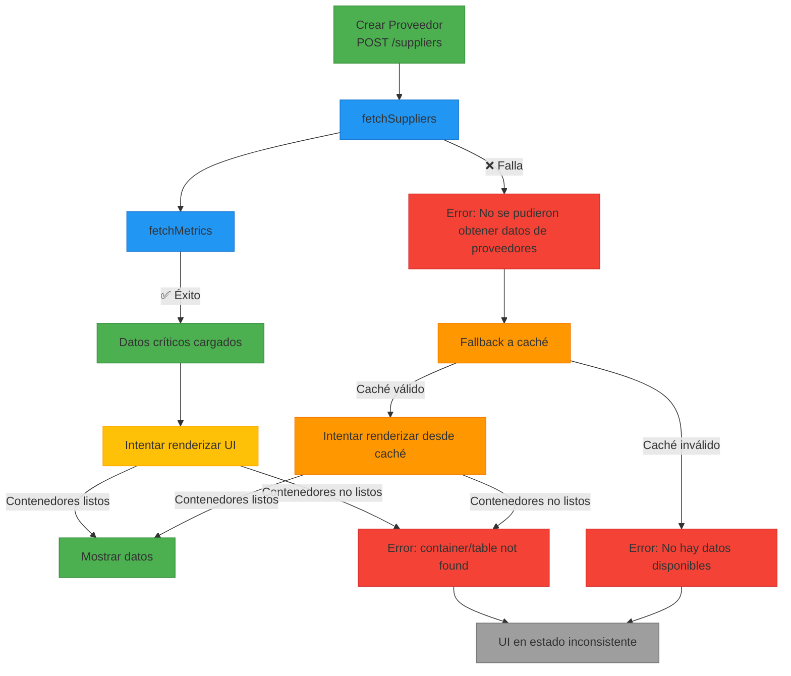

# Diagrama de Flujo del Problema Actual

## Puntos Críticos de Falla

1. **Falla en fetchSuppliers (Nodo B)**:
   - No maneja adecuadamente el caso donde la API de proveedores falla
   - Depende completamente del caché del dashboard
   - No hay fallback específico para proveedores

2. **Problema de sincronización (Nodo F)**:
   - No verifica si los contenedores de la UI están listos
   - Las funciones de renderizado asumen que el DOM está preparado
   - No hay mecanismo de reintento o espera

3. **Fallback inconsistente (Nodo I)**:
   - El mecanismo de fallback no está integrado con el sistema de caché
   - No actualiza el caché adecuadamente
   - No hay manejo de errores granular

## Problemas de Sincronización

1. **Load Orchestrator vs DOM**:
   - El orchestrator carga datos sin sincronizar con el estado del DOM
   - No hay verificación de que los contenedores estén listos antes de renderizar

2. **Renderizado asíncrono**:
   - Las funciones de renderizado se llaman sin garantía de que el DOM esté listo
   - No hay manejo de estados de carga para la UI

3. **Flujo de creación de proveedores**:
   - Después de crear un proveedor, no hay verificación del estado del DOM
   - No hay mecanismo para reintentar el renderizado cuando el DOM esté listo