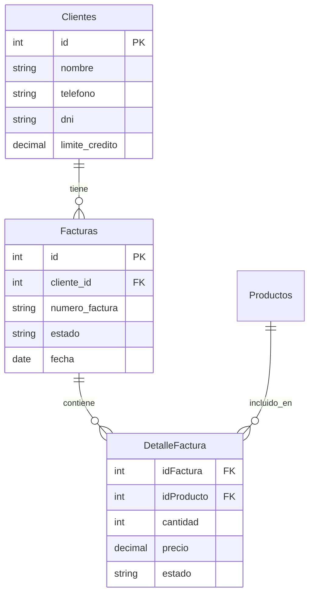
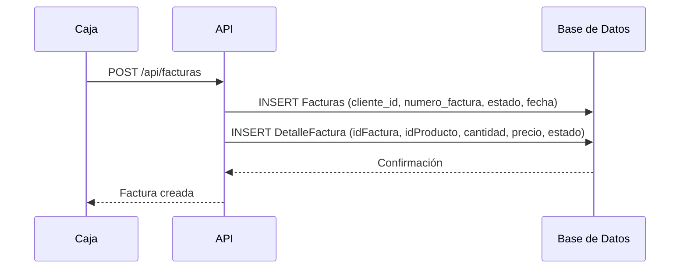
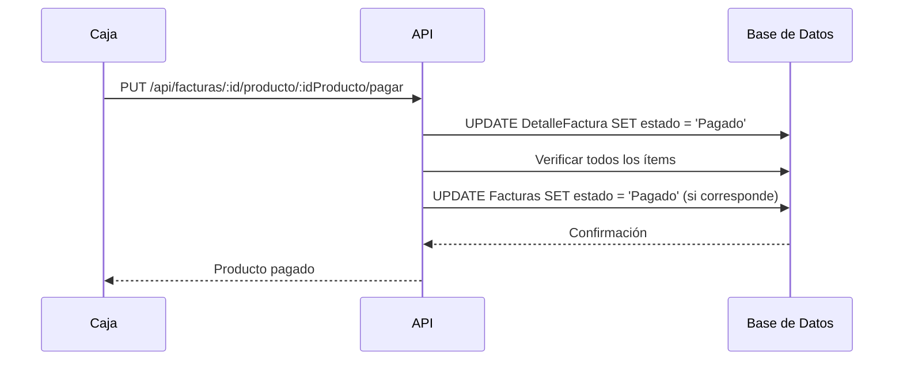

# Cliente - Cuenta Corriente

## 📋 Resumen

Módulo para gestionar ventas a cuenta corriente de clientes, permitiendo registrar facturas, pagar productos individuales y controlar el estado de deuda.

---

## 🗄️ Esquema de Base de Datos

### Tabla: `facturas`

```sql
CREATE TABLE Facturas (
    id INTEGER PRIMARY KEY,
    cliente_id INTEGER NOT NULL,
    numero_factura VARCHAR(20) UNIQUE NOT NULL,
    estado ENUM('Pagado', 'Adeudado') DEFAULT 'Adeudado',
    fecha DATE NOT NULL,
    FOREIGN KEY (cliente_id) REFERENCES Clientes(id)
);
```

### Tabla: `DetalleFactura`

```sql
CREATE TABLE DetalleFactura (
    idFactura INTEGER NOT NULL,
    idProducto INTEGER NOT NULL,
    cantidad INTEGER NOT NULL,
    precio DECIMAL(10,2) NOT NULL,
    estado ENUM('Pagado', 'Adeudado') DEFAULT 'Adeudado',
    PRIMARY KEY (idFactura, idProducto),
    FOREIGN KEY (idFactura) REFERENCES Facturas(id),
    FOREIGN KEY (idProducto) REFERENCES Productos(id)
);
```

---

## 📊 Diagrama de Entidades



---

## 🔄 Flujo de Operaciones

### 1. Crear Venta a Cuenta Corriente



### 2. Pagar Producto Individual



---

## 📝 Ejemplo de Uso

### Crear Factura

```javascript
// POST /api/facturas
{
    "cliente_id": 1,
    "items": [
        {"idProducto": 101, "cantidad": 2, "precio": 150.00},
        {"idProducto": 102, "cantidad": 1, "precio": 200.00}
    ]
}
```

### Consultar Estado de Factura

```sql
SELECT 
    f.id,
    f.numero_factura,
    f.estado,
    SUM(df.cantidad * df.precio) as total,
    SUM(CASE WHEN df.estado = 'Pagado' THEN df.cantidad * df.precio ELSE 0 END) as total_pagado,
    SUM(CASE WHEN df.estado = 'Adeudado' THEN df.cantidad * df.precio ELSE 0 END) as total_adeudado
FROM Facturas f
JOIN DetalleFactura df ON f.id = df.idFactura
WHERE f.id = 1
GROUP BY f.id;
```

### Pagar Producto Específico

```sql
UPDATE DetalleFactura
SET estado = 'Pagado'
WHERE idFactura = 1 AND idProducto = 101;
```

---

## 📁 Archivos del Módulo

| Archivo | Descripción |
|---------|-------------|
| `backend/facturas-endpoints.js` | Endpoints REST API |
| `frontend/cuenta-corriente-ui.js` | Interfaz de usuario |
| `backend/schema.sql` | Esquema de base de datos |

---

## 🔗 Endpoints API

| Método | Endpoint | Descripción |
|--------|----------|-------------|
| POST | `/api/facturas` | Crear factura |
| GET | `/api/facturas/:id` | Obtener factura |
| GET | `/api/facturas/:id/detalle` | Obtener detalle |
| PUT | `/api/facturas/:id/producto/:idProducto/pagar` | Pagar producto |
| GET | `/api/clientes/:id/cuenta-corriente` | Estado de cuenta |
