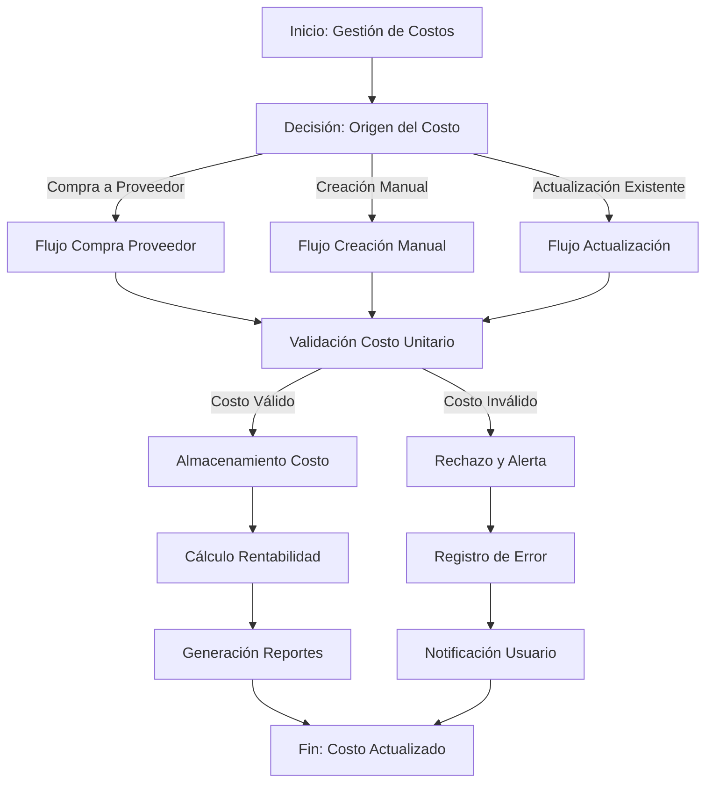
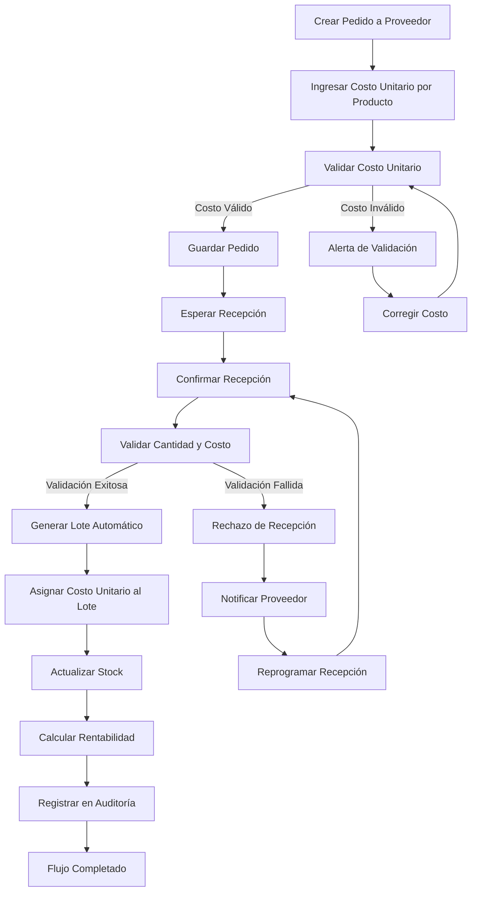
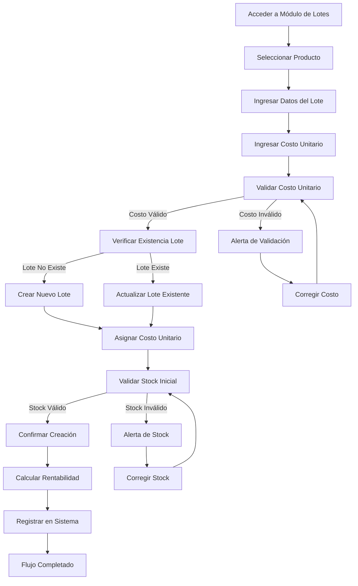
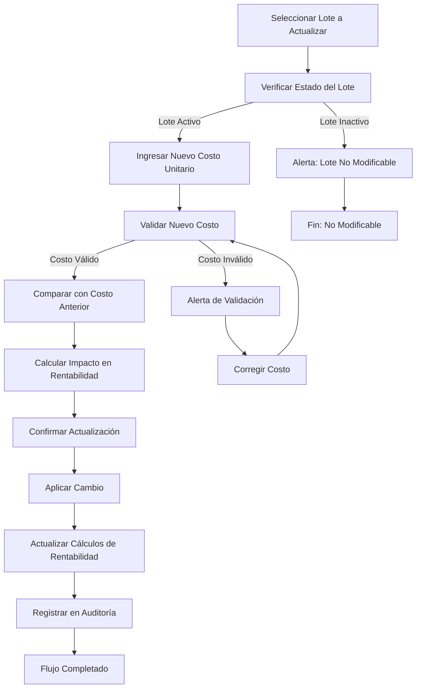
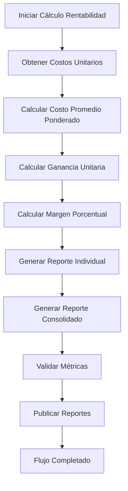

# 🔄 Flujos de Negocio - Sistema de Costos

## 📋 Resumen de Flujos

Este documento detalla los flujos de negocio críticos relacionados con el manejo de costos unitarios en el Sistema POS, incluyendo procesos, decisiones clave y puntos de control.

## 🎯 Flujo Principal: Gestión de Costos Unitarios

### Diagrama de Flujo General


## 🔄 Flujo 1: Compra a Proveedor

### Diagrama Detallado


### Puntos de Control Clave

#### 1. **Validación de Costo Unitario**
```javascript
// Validaciones realizadas
- Costo debe ser numérico y positivo
- Costo no debe superar el 120% del precio de venta
- Costo debe estar dentro del rango histórico del producto
- Costo debe coincidir con el registrado en el pedido
```

#### 2. **Control de Recepción**
```javascript
// Validaciones en recepción
- Cantidad recibida debe coincidir con cantidad pedida (±10%)
- Costo unitario debe coincidir con el del pedido
- Fecha de vencimiento debe ser válida
- Lote debe generarse con numeración única
```

#### 3. **Auditoría de Transacciones**
```javascript
// Registro de auditoría
{
    accion: 'RECEPCION_PEDIDO',
    descripcion: `Pedido ${numero_pedido} - Producto ${producto_id} - Costo ${costo_unitario}`,
    usuario: usuario_actual,
    timestamp: fecha_hora,
    detalles: {
        cantidad_pedida: cantidad_original,
        cantidad_recibida: cantidad_recibida,
        costo_unitario: costo_unitario,
        lote_generado: numero_lote
    }
}
```

## 🔄 Flujo 2: Creación Manual de Lotes

### Diagrama Detallado


### Decisiones Clave

#### 1. **Creación vs Actualización de Lote**
```javascript
// Lógica de decisión
if (existeLoteConMismoNumero(producto_id, numero_lote)) {
    // Actualizar lote existente
    accion = 'ACTUALIZAR';
    validaciones = ['costo_unitario', 'fecha_vencimiento', 'notas'];
} else {
    // Crear nuevo lote
    accion = 'CREAR';
    validaciones = ['costo_unitario', 'cantidad_inicial', 'fecha_vencimiento'];
}
```

#### 2. **Validación de Costo Manual**
```javascript
// Validaciones específicas para creación manual
- Costo unitario debe ser mayor que 0 o null
- Costo no debe ser mayor que el precio de venta
- Costo debe ser razonable comparado con costos históricos
- Costo null indica lote sin costo definido (para productos regalados)
```

## 🔄 Flujo 3: Actualización de Costos Existentes

### Diagrama Detallado


### Control de Impactos

#### 1. **Cálculo de Impacto en Rentabilidad**
```javascript
// Antes de la actualización
const costoAnterior = lote.costo_unitario;
const gananciaAnterior = precioVenta - costoAnterior;
const margenAnterior = (gananciaAnterior / costoAnterior) * 100;

// Después de la actualización
const costoNuevo = nuevoCostoUnitario;
const gananciaNueva = precioVenta - costoNuevo;
const margenNuevo = (gananciaNueva / costoNuevo) * 100;

// Impacto
const variacionGanancia = gananciaNueva - gananciaAnterior;
const variacionMargen = margenNuevo - margenAnterior;
```

#### 2. **Validación de Impacto**
```javascript
// Validaciones de impacto
if (variacionGanancia < -10) {
    // Alerta: Pérdida significativa de ganancia
    alertaCritica = true;
}

if (margenNuevo < 10) {
    // Alerta: Margen muy bajo
    alertaMargen = true;
}

if (costoNuevo > precioVenta) {
    // Alerta: Costo mayor que precio de venta
    alertaPerdida = true;
}
```

## 📊 Flujo 4: Cálculo y Reporte de Rentabilidad

### Diagrama Detallado


### Algoritmos de Cálculo

#### 1. **Costo Promedio Ponderado**
```javascript
// Algoritmo de cálculo
function calcularCostoPromedioPonderado(productoId) {
    const lotes = obtenerLotesActivos(productoId);
    
    let sumaCostos = 0;
    let sumaCantidades = 0;
    
    for (const lote of lotes) {
        sumaCostos += lote.costo_unitario * lote.cantidad_actual;
        sumaCantidades += lote.cantidad_actual;
    }
    
    if (sumaCantidades === 0) return null;
    
    return sumaCostos / sumaCantidades;
}
```

#### 2. **Rentabilidad por Lote**
```javascript
// Cálculo por lote individual
function calcularRentabilidadLote(lote, precioVenta) {
    return {
        costoUnitario: lote.costo_unitario,
        gananciaUnitaria: precioVenta - lote.costo_unitario,
        margenPorcentual: ((precioVenta - lote.costo_unitario) / lote.costo_unitario) * 100,
        gananciaTotal: (precioVenta - lote.costo_unitario) * lote.cantidad_actual
    };
}
```

## 🛡️ Controles de Calidad

### 1. **Validación de Precisión**
```javascript
// Validaciones de precisión decimal
- Costos unitarios: 2 decimales de precisión
- Cálculos de ganancia: 2 decimales de precisión
- Porcentajes de margen: 2 decimales de precisión
- Totales: sin decimales (redondeo al entero)
```

### 2. **Control de Consistencia**
```javascript
// Validaciones de consistencia
- Costo unitario debe ser menor o igual al precio de venta
- Margen de ganancia debe ser positivo (excepto casos especiales)
- Costo promedio ponderado debe estar entre costo mínimo y máximo
- Suma de ganancias por lote debe coincidir con ganancia total
```

### 3. **Auditoría de Cambios**
```javascript
// Registro de auditoría para todos los cambios
{
    tipo_cambio: 'ACTUALIZACION_COSTO',
    producto_id: 123,
    lote_id: 456,
    costo_anterior: 50.00,
    costo_nuevo: 52.00,
    usuario: 'usuario_actual',
    fecha_hora: '2025-12-29T14:00:00',
    motivo: 'Ajuste por aumento de precio del proveedor',
    impacto: {
        variacion_costo: 2.00,
        variacion_ganancia: -2.00,
        variacion_margen: -3.85
    }
}
```

## 📈 Métricas de Performance

### 1. **Tiempo de Procesamiento**
```javascript
// Métricas de performance
- Creación de lote: < 2 segundos
- Actualización de costo: < 1 segundo
- Cálculo de rentabilidad: < 5 segundos (hasta 1000 productos)
- Generación de reportes: < 10 segundos (reportes consolidados)
```

### 2. **Precisión de Cálculos**
```javascript
// Métricas de precisión
- Error de redondeo: < 0.01%
- Consistencia de totales: 100%
- Precisión de márgenes: ±0.01%
- Exactitud de ganancias: 100%
```

## 🎯 Recomendaciones Estratégicas

### 1. **Automatización de Validaciones**
```javascript
// Sistema de validación automática
- Validación de rangos de costo basado en historial
- Alertas automáticas para costos fuera de rango
- Validación de consistencia entre costos y precios
- Auditoría automática de cambios significativos
```

### 2. **Integración con Proveedores**
```javascript
// Sistema de integración
- Actualización automática de costos desde sistemas de proveedores
- Validación de costos contra catálogos de proveedores
- Alertas de cambios de precios de proveedores
- Sincronización de catálogos de productos y precios
```

### 3. **Optimización de Procesos**
```javascript
// Mejoras de procesos
- Validación en tiempo real durante la creación de lotes
- Sistema de alertas proactivas para costos inusuales
- Reportes automáticos de rentabilidad por periodo
- Dashboard de control de costos y márgenes
```

Este documento proporciona una visión completa de los flujos de negocio críticos para el manejo de costos unitarios en tu Sistema POS, permitiendo una gestión eficiente y controlada de la rentabilidad.