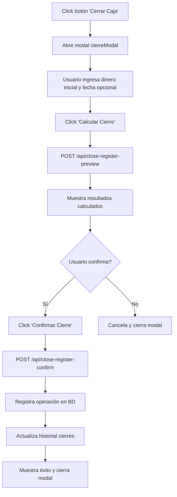

# Funciones del Módulo de Cierre de Caja

## Descripción General
El módulo de cierre de caja permite a los usuarios (cajeros y administradores) realizar el cierre diario de ventas, calculando totales, diferencias y guardando un historial de operaciones. Es una funcionalidad crítica para el control financiero del punto de venta.

## Funciones Principales

### 1. Modal de Cierre de Caja
- **Propósito**: Realizar el cierre de caja para una fecha específica.
- **Campos de entrada**:
  - Dinero inicial del día (obligatorio, numérico)
  - Fecha específica (opcional, por defecto hoy)
- **Flujo**:
  1. Usuario ingresa dinero inicial y fecha
  2. Sistema calcula preview con datos de ventas
  3. Muestra resultados: total ventas, total esperado, diferencia, cantidad de ventas
  4. Usuario confirma o cancela el cierre

### 2. Historial de Cierres
- **Propósito**: Visualizar y gestionar cierres anteriores.
- **Funcionalidades**:
  - Tabla con columnas: fecha, dinero inicial, total ventas, total esperado, diferencia, cantidad ventas
  - Botón "Ver Detalles" para cada cierre
  - Dropdown para seleccionar cierre y ver detalles
  - Resaltado de fila seleccionada

### 3. Detalles de Cierre
- **Propósito**: Mostrar información completa de un cierre específico.
- **Información mostrada**:
  - Fecha y hora
  - Tipo de cierre (normal/retroactivo)
  - Dinero inicial
  - Total ventas
  - Total esperado
  - Diferencia (con color: rojo si negativa, verde si positiva)
  - Cantidad de ventas
  - Notas (opcional)

### 4. Alertas de Cierres Pendientes
- **Propósito**: Notificar al usuario si hay cierres pendientes.
- **Comportamiento**:
  - Verifica cierres diarios al cargar el dashboard
  - Muestra alerta modal si faltan cierres
  - Opción para ignorar temporalmente

### 5. Cierre Retroactivo
- **Propósito**: Permitir cierres para fechas pasadas.
- **Flujo**:
  1. Usuario selecciona fecha pasada
  2. Sistema calcula automáticamente dinero inicial y ventas
  3. Muestra modal de cierre con datos precalculados
  4. Usuario confirma el cierre retroactivo

## Endpoints de API

### GET /api/cierres
- **Propósito**: Listar todos los cierres de caja.
- **Permisos**: read_cierres (cajero, admin)
- **Respuesta**: Array de objetos cierre con id, fecha_cierre, dinero_inicial, total_ventas, total_esperado, diferencia, cantidad_ventas, tipo_cierre, notas

### POST /api/close-register-preview
- **Propósito**: Calcular preview del cierre sin guardarlo.
- **Permisos**: create_cierres (cajero, admin)
- **Parámetros**: fecha, dineroInicial
- **Respuesta**: Datos calculados del cierre

### POST /api/close-register-confirm
- **Propósito**: Confirmar y guardar el cierre de caja.
- **Permisos**: create_cierres (cajero, admin)
- **Parámetros**: Datos del preview + diferencia, notas
- **Validaciones**: Evita duplicados para la misma fecha

## Permisos
- **Cajero**: Acceso completo a cierres (lectura, creación)
- **Admin**: Acceso completo incluyendo actualización y eliminación
- **Invitado**: Solo lectura de cierres

## Último Cambio Importante
- **Fecha**: Reciente (no especificada)
- **Descripción**: Se quitó código de estilo (CSS) del archivo `dashboard.html` para mejorar la separación de responsabilidades y mantenibilidad del código.

## Flujo Paso a Paso del Cierre de Caja

1. **Click en botón "Cerrar Caja"**: Abre el modal de cierre de caja (`cierreModal`)
2. **Ingreso de datos iniciales**:
   - Dinero inicial del día (campo obligatorio)
   - Fecha específica (opcional, por defecto hoy)
3. **Click en "Calcular Cierre"**: Llama a `calculateCloseRegister()`
   - Envía POST a `/api/close-register-preview` con fecha y dinero inicial
   - Recibe datos calculados: total_ventas, total_esperado, diferencia, cantidad_ventas
4. **Visualización de resultados**: Muestra sección de resultados con:
   - Dinero inicial
   - Total ventas
   - Total esperado (dinero_inicial + total_ventas)
   - Diferencia (total_esperado - dinero_real_contado)
   - Cantidad de ventas
   - Fecha del cierre
5. **Click en "Confirmar Cierre"**: Llama a `confirmCloseRegister()`
   - Envía POST a `/api/close-register-confirm` con todos los datos + notas opcionales
   - Registra la operación en la base de datos (tabla `cierres_caja`)
   - Actualiza el historial de cierres
6. **Cierre exitoso**: Modal se cierra, muestra alerta de éxito, actualiza la UI

## Diagrama de Flujo del Cierre de Caja

## Notas Técnicas
- Los cálculos se basan en ventas registradas en la base de datos para la fecha especificada.
- La diferencia se calcula como: total_esperado - dinero_contado_real (ingresado por usuario).
- Se previene la creación de cierres duplicados para la misma fecha.
- El historial se carga de forma lazy para optimizar rendimiento.