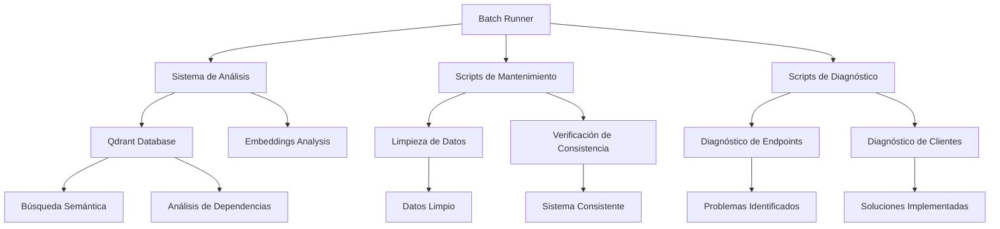

# 🛠️ Herramientas Disponibles en el Sistema POS

Este documento describe todas las herramientas disponibles en tu proyecto POS y cómo puedes utilizarlas para mejorar el desarrollo, mantenimiento y análisis del sistema.

## 📦 Herramientas Principales

### 1. **Batch Runner** (Recién instalado)
**Función:** Ejecución masiva de comandos y scripts
**Uso en el proyecto:**
```bash
# Ejecutar múltiples scripts de mantenimiento
batch-runner run --scripts="clean_test_data.js,check_stock_consistency.js,verify_client_debts.js"

# Ejecutar pruebas en lote
batch-runner run --scripts="test_barcode_integration.js,test_cuenta_corriente_deudas.js,test_usb_scanner.js"

# Tareas de limpieza programada
batch-runner schedule --cron="0 2 * * *" --scripts="clean_test_data.js,backup_proyecto_20251226"
```

**Beneficios para tu proyecto:**
- Automatización de tareas repetitivas
- Ejecución paralela de scripts de mantenimiento
- Programación de tareas de limpieza y verificación

### 2. **Sistema de Análisis de Código con Qdrant**
**Ubicación:** `code-analysis/`
**Función:** Análisis inteligente del código mediante embeddings y búsqueda semántica

**Comandos principales:**
```bash
cd code-analysis

# Iniciar el sistema completo
npm run system:start

# Iniciar Qdrant (base de datos vectorial)
npm run qdrant:start

# Indexar el códigobase
npm run index-codebase

# Iniciar servidor de análisis
npm run simple-server

# Verificar salud del sistema
npm run system:health

# Optimizar rendimiento
npm run system:maximum-power
```

**Uso en tu proyecto POS:**
- **Búsqueda semántica:** Encontrar código relacionado rápidamente
- **Análisis de dependencias:** Identificar relaciones entre módulos
- **Detección de duplicados:** Encontrar código repetido
- **Asistente de desarrollo:** Recomendaciones basadas en embeddings

### 3. **Sistema de Deudas y Cuenta Corriente**
**Ubicación:** `backend/debts-endpoints.js`, `shared/cuenta-corriente-manager.js`
**Función:** Gestión avanzada de deudas y pagos a cuenta corriente

**Endpoints clave:**
```bash
# Ver deudas de un cliente
GET /api/debts/client/{clientId}

# Actualizar deuda
PUT /api/debts/{debtId}

# Pago parcial
POST /api/debts/{debtId}/payment

# Ver resumen de cuenta corriente
GET /api/clients/{clientId}/account-summary
```

### 4. **Integración de Escáner de Códigos de Barras**
**Ubicación:** `frontend/barcode-scanner.js`, `backend/barcode-scanner.html`
**Función:** Lectura automática de códigos de barras para productos

**Uso:**
```javascript
// Iniciar escáner
const scanner = new BarcodeScanner();
scanner.start();

// Evento de lectura exitosa
scanner.on('barcode', (code) => {
    // Buscar producto por código
    buscarProductoPorCodigo(code);
});
```

### 5. **Sistema de Generación de Códigos de Barras**
**Ubicación:** `generate-barcodes.js`, `barcode-generator.html`
**Función:** Crear códigos de barras para productos

**Uso:**
```bash
# Generar códigos para productos existentes
node generate-barcodes.js

# Generar códigos específicos
node generate-barcodes.js --product-id=123 --format=png
```

## 🚀 Scripts de Mantenimiento

### Scripts de Limpieza y Verificación
```bash
# Limpieza de datos huérfanos
node limpiar_datos_huerfanos.js

# Verificación de consistencia de stock
node check_stock_consistency.js

# Limpieza de datos de prueba
node clean_test_data.js

# Verificación de deudas
node verify_client_debts.js
```

### Scripts de Diagnóstico
```bash
# Diagnóstico general del sistema
node diagnostic-general.js

# Diagnóstico de endpoints
node diagnostic_endpoints.js

# Diagnóstico de clientes
node diagnostic-clientes-cuenta-corriente.js

# Diagnóstico de escáner USB
node test_usb_scanner.js
```

### Scripts de Pruebas
```bash
# Prueba de integración de códigos de barras
node test_barcode_integration.js

# Prueba de cuenta corriente
node test_cuenta_corriente_deudas.js

# Prueba de escáner USB
node test_usb_scanner.js

# Prueba de impresión
node test_print_integration.js
```

## 📊 Herramientas de Desarrollo

### 1. **Optimización de Rendimiento**
**Archivos:** `optimize-indexacion.bat`, `maximum-power.bat`
**Función:** Optimizar el rendimiento del sistema

```bash
# Optimizar indexación
optimize-indexacion.bat

# Máxima potencia del sistema
maximum-power.bat
```

### 2. **Gestión de Base de Datos**
**Ubicación:** `backend/database-utils.js`
**Función:** Operaciones avanzadas de base de datos

```javascript
// Recalcular stocks
await recalculateStocks();

// Verificar integridad
await verifyIntegrity();

// Optimizar consultas
await optimizeQueries();
```

### 3. **Sistema de Logs y Monitoreo**
**Ubicación:** `backend/error-handler.js`, `backend/response-middleware.js`
**Función:** Registro y monitoreo de actividades

```javascript
// Registrar actividad
logger.info('Venta realizada', { ventaId, monto, metodoPago });

// Monitorear endpoints
monitorEndpoint('/api/ventas', 'POST');
```

## 🔧 Herramientas de Instalación y Despliegue

### 1. **Scripts de Instalación**
**Ubicación:** `Post_2025/installer/`
**Función:** Instalación automática del sistema

```bash
# Instalar dependencias
Post_2025/installer/install-vscode-extension.bat

# Configurar Qdrant
Post_2025/installer/setup_qdrant.bat

# Integrar análisis de código
Post_2025/installer/integrate-code-analysis.bat
```

### 2. **Scripts de Lanzamiento**
**Ubicación:** `Post_2025/installer/launchers/`
**Función:** Inicio rápido del sistema

```bash
# Iniciar todo el sistema
Post_2025/installer/launchers/run_all.bat

# Iniciar solo backend
Post_2025/installer/launchers/run.bat

# Configurar ngrok
Post_2025/installer/launchers/ngrok_setup.bat
```

## 📈 Uso Estratégico de las Herramientas

### Para Desarrolladores
1. **Batch Runner** para automatizar tareas de desarrollo
2. **Sistema de Análisis** para entender el códigobase
3. **Scripts de diagnóstico** para resolver problemas rápidamente

### Para Administradores
1. **Scripts de mantenimiento** para limpieza programada
2. **Sistema de monitoreo** para seguimiento del rendimiento
3. **Scripts de verificación** para asegurar la integridad del sistema

### Para Soporte Técnico
1. **Scripts de diagnóstico** para identificar problemas
2. **Sistema de logs** para auditoría y trazabilidad
3. **Scripts de pruebas** para validar soluciones

## 🎯 Recomendaciones de Uso

### Diariamente
- Ejecutar scripts de verificación de consistencia
- Revisar logs de errores
- Verificar salud del sistema

### Semanalmente
- Ejecutar limpieza de datos huérfanos
- Actualizar índices de búsqueda
- Verificar integridad de la base de datos

### Mensualmente
- Realizar análisis de rendimiento
- Optimizar consultas lentas
- Actualizar dependencias

### En Desarrollo
- Usar Batch Runner para pruebas automatizadas
- Utilizar sistema de análisis para entender el código
- Implementar nuevas funcionalidades con scripts de validación

## 🔗 Integración entre Herramientas



Este ecosistema de herramientas te permite gestionar tu proyecto POS de manera eficiente, automatizada y con un alto nivel de control y monitoreo.