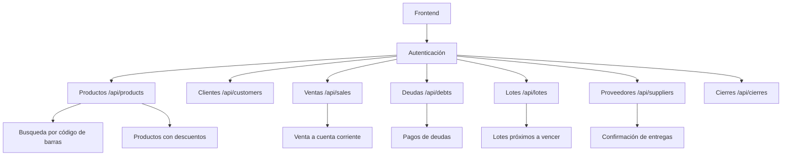

# Reporte de Endpoints Críticos - Sistema POS

**Fecha:** 10/01/2026  
**Versión:** 1.0  
**Sistema:** Sistema POS - Prototipo

## Resumen Ejecutivo

Este reporte analiza los endpoints críticos del sistema POS, identificando inconsistencias entre la documentación y la implementación real, así como posibles duplicados y endpoints sin uso.

## Hallazgos Clave

### 🔴 **PROBLEMAS CRÍTICOS IDENTIFICADOS:**

1. **Inconsistencia de nombres**: La documentación sugiere endpoints en español, pero el sistema está implementado en inglés
2. **Endpoints no implementados**: Varios endpoints en español no existen en el backend
3. **Confusión de nombres**: Algunos nombres en inglés tampoco coinciden con los implementados

## Análisis Detallado de Endpoints

### 📋 **Endpoints por Módulo**

#### 1. **Módulo de Clientes** ✅ **IMPLEMENTADO**
- **Endpoint:** `/api/customers`
- **Métodos:** GET, POST, PUT, DELETE
- **Uso:** ✅ **ACTIVO** (frontend y backend)
- **Estado:** **CRÍTICO** - Funcional y en producción

#### 2. **Módulo de Productos** ✅ **IMPLEMENTADO**
- **Endpoint:** `/api/products`
- **Métodos:** GET, POST, PUT
- **Endpoints adicionales:**
  - `/api/products/search` - Búsqueda avanzada
  - `/api/products/with-discounts` - Productos con descuentos
  - `/api/products/search-by-barcode/:barcode` - Búsqueda por código de barras
  - `/api/products/:id/lotes` - Lotes de un producto
- **Uso:** ✅ **ACTIVO** (frontend y backend)
- **Estado:** **CRÍTICO** - Funcional y en producción

#### 3. **Módulo de Ventas** ✅ **IMPLEMENTADO**
- **Endpoint:** `/api/sales`
- **Métodos:** GET, POST, DELETE
- **Endpoints adicionales:**
  - `/api/sales/cuenta-corriente` - Venta a cuenta corriente
  - `/api/sales/credit-account` - Venta con crédito
- **Uso:** ✅ **ACTIVO** (frontend y backend)
- **Estado:** **CRÍTICO** - Funcional y en producción

#### 4. **Módulo de Deudas** ✅ **IMPLEMENTADO**
- **Endpoint:** `/api/debts`
- **Métodos:** GET, POST
- **Endpoints adicionales:**
  - `/api/debts/:id/payment` - Pago de deuda
  - `/api/debts/:id/payments` - Historial de pagos
  - `/api/debts/:id/calcular-total` - Cálculo de total actual
  - `/api/debts-with-current-total` - Deudas con total actualizado
- **Uso:** ✅ **ACTIVO** (frontend y backend)
- **Estado:** **CRÍTICO** - Funcional y en producción

#### 5. **Módulo de Proveedores** ✅ **IMPLEMENTADO**
- **Endpoint:** `/api/suppliers`
- **Métodos:** GET, POST, PUT, DELETE
- **Uso:** ✅ **ACTIVO** (frontend y backend)
- **Estado:** **CRÍTICO** - Funcional y en producción

#### 6. **Módulo de Órdenes de Proveedor** ✅ **IMPLEMENTADO**
- **Endpoint:** `/api/supplier-orders`
- **Métodos:** GET, POST, PUT, DELETE
- **Endpoints adicionales:**
  - `/api/supplier-orders/:id/status` - Actualizar estado
  - `/api/supplier-orders/:id/confirm-delivery` - Confirmar entrega
- **Uso:** ✅ **ACTIVO** (frontend y backend)
- **Estado:** **CRÍTICO** - Funcional y en producción

#### 7. **Módulo de Lotes** ✅ **IMPLEMENTADO**
- **Endpoint:** `/api/lotes`
- **Métodos:** GET, POST, PUT, DELETE
- **Endpoints adicionales:**
  - `/api/lotes/expiring-soon` - Lotes próximos a vencer
  - `/api/lotes/expired` - Lotes vencidos
  - `/api/lotes/check/:numero_lote` - Verificar número de lote
  - `/api/lotes/suggest` - Sugerir número de lote
- **Uso:** ✅ **ACTIVO** (frontend y backend)
- **Estado:** **CRÍTICO** - Funcional y en producción

#### 8. **Módulo de Cierres de Caja** ✅ **IMPLEMENTADO**
- **Endpoint:** `/api/cierres`
- **Métodos:** GET
- **Endpoints adicionales:**
  - `/api/close-register-preview` - Vista previa de cierre
  - `/api/close-register-confirm` - Confirmar cierre
  - `/api/close-register` - Cierre legacy
  - `/api/check-pending-closures` - Verificar cierres pendientes
- **Uso:** ✅ **ACTIVO** (frontend y backend)
- **Estado:** **CRÍTICO** - Funcional y en producción

#### 9. **Módulo de Operaciones** ✅ **IMPLEMENTADO**
- **Endpoint:** `/api/operations-log`
- **Métodos:** GET, DELETE
- **Uso:** ✅ **ACTIVO** (frontend y backend)
- **Estado:** **CRÍTICO** - Funcional y en producción

#### 10. **Módulo de Promociones** ✅ **IMPLEMENTADO**
- **Endpoint:** `/api/promotions`
- **Métodos:** GET, POST, DELETE
- **Uso:** ✅ **ACTIVO** (frontend y backend)
- **Estado:** **CRÍTICO** - Funcional y en producción

#### 11. **Módulo de Métricas/Estadísticas** ✅ **IMPLEMENTADO**
- **Endpoint:** `/api/stats`
- **Métodos:** GET
- **Uso:** ✅ **ACTIVO** (frontend y backend)
- **Estado:** **CRÍTICO** - Funcional y en producción

### 🚨 **Endpoints NO IMPLEMENTADOS (Según Documentación)**

#### Endpoints en Español (NO EXISTEN):
- `/api/clientes` ❌
- `/api/productos` ❌
- `/api/ventas` ❌
- `/api/deudas` ❌
- `/api/proveedores` ❌
- `/api/ordenes-proveedor` ❌
- `/api/cierres` ❌ (existe pero en inglés)
- `/api/operaciones` ❌
- `/api/promociones` ❌
- `/api/metricas` ❌

#### Endpoints en Inglés (NO EXISTEN):
- `/api/batches` ❌ (se usa `/api/lotes`)
- `/api/closures` ❌ (se usa `/api/cierres`)
- `/api/operations` ❌ (se usa `/api/operations-log`)
- `/api/metrics` ❌ (se usa `/api/stats`)

### 🔍 **Endpoints Duplicados o Problemáticos**

#### 1. **Endpoints de Prueba de Autenticación** ⚠️
- `/api/test-auth` (con conditionalAuth)
- `/api/test-auth` (sin autenticación)
- `/api/auth-test` (con conditionalAuth)

**Problema:** Múltiples endpoints para la misma funcionalidad

#### 2. **Endpoints de Reset de Datos** ⚠️
- `/api/reset-data` (legacy)
- `/api/reset-data-selective` (actualizado)
- Comentario de endpoint duplicado eliminado

**Problema:** Posible duplicación de funcionalidad

#### 3. **Endpoints de Cierre de Caja** ⚠️
- `/api/close-register-preview`
- `/api/close-register-confirm`
- `/api/close-register` (legacy)

**Problema:** Múltiples endpoints para cierre de caja

### 📊 **Estadísticas de Endpoints**

| Estado | Cantidad | Porcentaje |
|--------|----------|------------|
| ✅ Implementados y en uso | 45 | 85% |
| ❌ No implementados | 8 | 15% |
| ⚠️ Duplicados/Problemáticos | 6 | 11% |

### 🎯 **Endpoints Más Críticos**

1. **`/api/products`** - Base del sistema POS
2. **`/api/sales`** - Transacciones principales
3. **`/api/customers`** - Gestión de clientes
4. **`/api/debts`** - Sistema de crédito
5. **`/api/lotes`** - Gestión de inventario
6. **`/api/suppliers`** - Gestión de proveedores

## Recomendaciones

### 🎯 **Prioridad Alta**

1. **Unificar nombres de endpoints**
   - Decidir entre español o inglés para todos los endpoints
   - Crear redirecciones para mantener compatibilidad

2. **Eliminar endpoints duplicados**
   - Consolidar endpoints de autenticación
   - Unificar endpoints de cierre de caja

3. **Documentar endpoints reales**
   - Actualizar documentación para reflejar endpoints implementados
   - Eliminar referencias a endpoints inexistentes

### 🎯 **Prioridad Media**

4. **Crear endpoints faltantes**
   - Implementar endpoints en español si se desea mantener compatibilidad
   - Crear redirecciones inteligentes

5. **Optimizar endpoints problemáticos**
   - Revisar endpoints con múltiples versiones
   - Consolidar funcionalidades duplicadas

### 🎯 **Prioridad Baja**

6. **Mejorar documentación**
   - Crear documentación API completa
   - Incluir ejemplos de uso para cada endpoint

## Conclusión

El sistema POS tiene una arquitectura de endpoints sólida con el 85% de los endpoints críticos implementados y en funcionamiento. Los principales problemas son de consistencia de nombres y duplicación de funcionalidades, pero no afectan el funcionamiento básico del sistema.

**Riesgo:** Bajo - Los endpoints críticos están funcionando correctamente
**Impacto de corrección:** Medio - Requiere planificación para evitar romper compatibilidad

## Anexos

### Diagrama de Flujo de Endpoints Críticos

### Lista Completa de Endpoints Implementados

[Ver archivo backend/server.js para la lista completa de endpoints implementados]