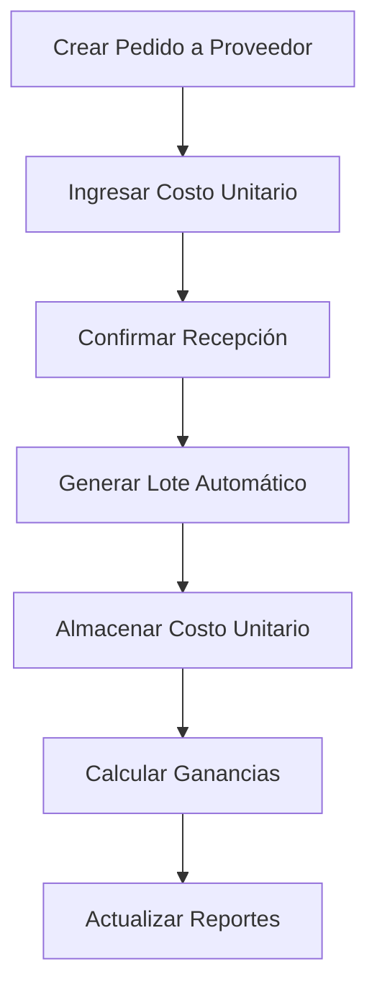
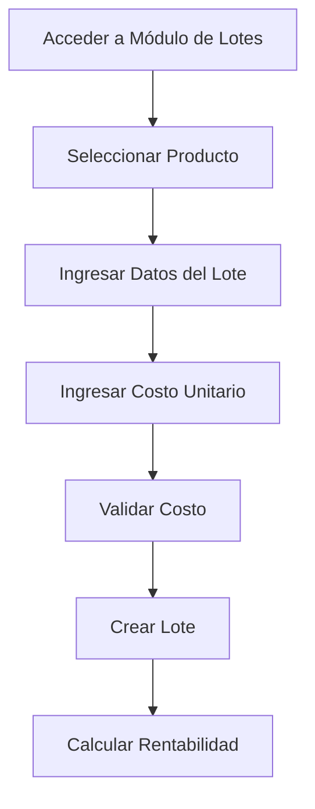
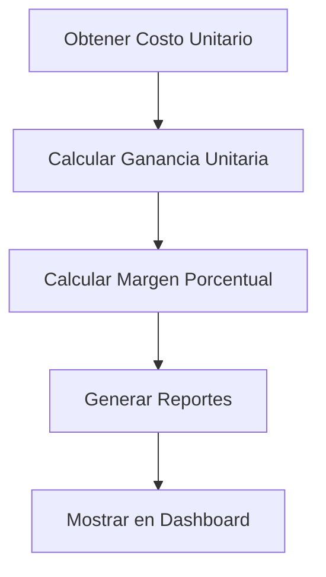

# 📊 Sistema de Costos - Precio de Compra

## 🎯 Resumen Ejecutivo

Este documento detalla el sistema de gestión de precios de compra (`costo_unitario`) en el Sistema POS, incluyendo su almacenamiento, actualización, cálculos de ganancias y flujos de negocio.

## 📍 Ubicación y Estructura

### Tabla de Lotes
La columna `costo_unitario` se encuentra en la tabla `lotes` y representa el **precio de compra** del producto.

```sql
CREATE TABLE lotes (
    id INTEGER PRIMARY KEY AUTOINCREMENT,
    producto_id INTEGER NOT NULL,
    numero_lote TEXT NOT NULL,
    fecha_vencimiento DATE NOT NULL,
    cantidad_inicial INTEGER NOT NULL,
    cantidad_actual INTEGER NOT NULL CHECK (cantidad_actual >= 0),
    costo_unitario REAL,  -- ← PRECIO DE COMPRA
    notas TEXT,
    estado TEXT DEFAULT 'activo',
    fecha_ingreso DATETIME DEFAULT CURRENT_TIMESTAMP,
    created_at DATETIME DEFAULT CURRENT_TIMESTAMP
);
```

## 🔄 Fuentes de Actualización del Costo Unitario

### 1. **Creación Manual de Lotes**
**Endpoint:** `POST /api/lotes`

```javascript
// Solicitud típica
{
    "producto_id": 123,
    "numero_lote": "L001-2025",
    "fecha_vencimiento": "2026-12-31",
    "cantidad_inicial": 100,
    "costo_unitario": 50.75,  // ← PRECIO DE COMPRA
    "notas": "Lote comprado al proveedor XYZ"
}

// Proceso de almacenamiento
await dbRun(
    `INSERT INTO lotes (producto_id, numero_lote, fecha_vencimiento, cantidad_inicial, cantidad_actual, costo_unitario, notas)
     VALUES (?, ?, ?, ?, ?, ?, ?)`,
    [producto_id, numero_lote, fecha_vencimiento, cantidad_inicial, cantidad_inicial, costo_unitario || null, notas || '']
);
```

### 2. **Recepción de Pedidos de Proveedores**
**Endpoint:** `POST /api/supplier-orders/:id/confirm-delivery`

```javascript
// Flujo de actualización automática
for (const item of items) {
    // Validación del costo unitario
    const costoUnitario = parseFloat(item.costo_unitario);
    if (isNaN(costoUnitario) || costoUnitario < 0) {
        throw new Error(`Costo unitario inválido para el producto ${item.producto_id}`);
    }
    
    // Creación automática del lote con costo del pedido
    await dbRun(
        `INSERT INTO lotes (producto_id, numero_lote, fecha_vencimiento, cantidad_inicial, cantidad_actual, costo_unitario, notas, fecha_ingreso)
         VALUES (?, ?, ?, ?, ?, ?, ?, ?)`,
        [
            item.producto_id,
            loteNumber,
            item.fecha_vencimiento,
            cantidadRecibida,
            cantidadRecibida,
            costoUnitario,  // ← PRECIO DE COMPRA desde el pedido
            `Lote generado automáticamente - Pedido ${order[0].numero_pedido}`,
            fechaEntregaReal
        ]
    );
}
```

### 3. **Items Extra del Proveedor**
```javascript
// Para productos adicionales no solicitados originalmente
await dbRun(
    `INSERT INTO lotes (producto_id, numero_lote, fecha_vencimiento, cantidad_inicial, cantidad_actual, costo_unitario, notas, fecha_ingreso)
     VALUES (?, ?, ?, ?, ?, ?, ?, ?)`,
    [
        extraItem.producto_id,
        loteNumber,
        extraItem.fecha_vencimiento,
        cantidadExtra,
        cantidadExtra,
        parseFloat(extraItem.costo_unitario) || 0,  // ← PRECIO DE COMPRA
        `Item extra del proveedor - Pedido ${order[0].numero_pedido}`,
        fechaEntregaReal
    ]
);
```

## 📈 Cálculos de Ganancias y Rentabilidad

### 1. **Ganancia Unitaria**
```javascript
// Cálculo por producto
SELECT
    p.precio as precio_venta,
    MAX(CASE WHEN l.estado = 'activo' AND l.cantidad_actual > 0 THEN l.costo_unitario END) as costo_lote_mas_reciente,
    ROUND(p.precio - costo_lote_mas_reciente, 2) as ganancia_unitaria
FROM productos p
LEFT JOIN lotes l ON p.id = l.producto_id
WHERE p.id = ?
```

### 2. **Margen de Ganancia Porcentual**
```javascript
// Cálculo del margen de ganancia
SELECT
    p.precio as precio_venta,
    MAX(CASE WHEN l.estado = 'activo' AND l.cantidad_actual > 0 THEN l.costo_unitario END) as costo_lote_mas_reciente,
    CASE
        WHEN costo_lote_mas_reciente > 0
        THEN ROUND(((p.precio - costo_lote_mas_reciente) / costo_lote_mas_reciente) * 100, 2)
        ELSE NULL
    END as margen_ganancia_porcentaje
FROM productos p
LEFT JOIN lotes l ON p.id = l.producto_id
```

### 3. **Costo Promedio Ponderado**
```javascript
// Para productos con múltiples lotes
const costoPromedioPonderado = 
    SUM(l.costo_unitario * l.cantidad_actual) / SUM(l.cantidad_actual);

// Ganancia total potencial
const gananciaTotalPotencial = 
    stock * (precio_venta - costoPromedioPonderado);
```

## 🔄 Flujos de Negocio

### Flujo 1: Compra a Proveedor


### Flujo 2: Creación Manual de Lote


### Flujo 3: Cálculo de Rentabilidad


## 🛡️ Validaciones y Controles

### 1. **Validación de Costo Unitario**
```javascript
// Validaciones en endpoints
const costoUnitario = parseFloat(item.costo_unitario);
if (isNaN(costoUnitario) || costoUnitario < 0) {
    throw new Error(`Costo unitario inválido para el producto ${item.producto_id}`);
}
```

### 2. **Auditoría de Cambios**
```javascript
// Registro de cambios en lotes
if (costo_unitario !== undefined && oldLote.costo_unitario !== costo_unitario) {
    changes.push(`costo: ${oldLote.costo_unitario} → ${costo_unitario}`);
}
```

### 3. **Control de Precios**
```javascript
// Comparación costo vs precio de venta
const costoUnitario = parseFloat(item.costo_unitario) || originalItem.precio_unitario;
if (costoUnitario > precio_venta) {
    // Alerta de margen negativo
    console.warn(`Alerta: Costo unitario (${costoUnitario}) mayor que precio de venta (${precio_venta})`);
}
```

## 📊 Reportes y Métricas

### 1. **Reporte de Rentabilidad por Producto**
```javascript
// Endpoint: GET /api/products/profitability
{
    "id": 123,
    "nombre": "Producto Ejemplo",
    "precio_venta": 100.00,
    "costo_promedio_ponderado": 60.50,
    "ganancia_unitaria": 39.50,
    "margen_ganancia_porcentaje": 65.29,
    "ganancia_total_potencial": 3950.00
}
```

### 2. **Reporte de Costos por Lote**
```javascript
// Endpoint: GET /api/products/:id/lotes
{
    "lote_id": 456,
    "numero_lote": "L001-2025",
    "costo_unitario": 50.75,
    "cantidad_actual": 80,
    "ganancia_unitaria": 49.25,
    "margen_ganancia_porcentaje": 97.04,
    "ganancia_total_lote": 3940.00
}
```

## 🔧 Endpoints Clave

### Creación de Lotes
- **POST** `/api/lotes` - Creación manual de lotes con costo unitario
- **PUT** `/api/lotes/:id` - Actualización de costo unitario

### Recepción de Pedidos
- **POST** `/api/supplier-orders/:id/confirm-delivery` - Generación automática de lotes con costos

### Consulta de Rentabilidad
- **GET** `/api/products/profitability` - Reporte de rentabilidad por producto
- **GET** `/api/products/:id/lotes` - Detalle de costos por lote

## 📝 Notas Importantes

1. **Conservación de Costos:** Los costos unitarios se mantienen congelados al momento de la creación del lote para auditoría
2. **Precisión Decimal:** Se utiliza precisión de 2 decimales para cálculos monetarios
3. **Fallback:** Si no se proporciona costo unitario, se utiliza el precio unitario del pedido como fallback
4. **Auditoría:** Todos los cambios en costos son registrados para trazabilidad

## 🎯 Mejoras Recomendadas

1. **Validación de Margen Mínimo:** Implementar validación de margen de ganancia mínimo
2. **Historial de Costos:** Crear historial de cambios de costo unitario por producto
3. **Alertas de Costo:** Sistema de alertas para costos que superen el precio de venta
4. **Integración Proveedores:** Conexión directa con sistemas de proveedores para actualización automática de costos