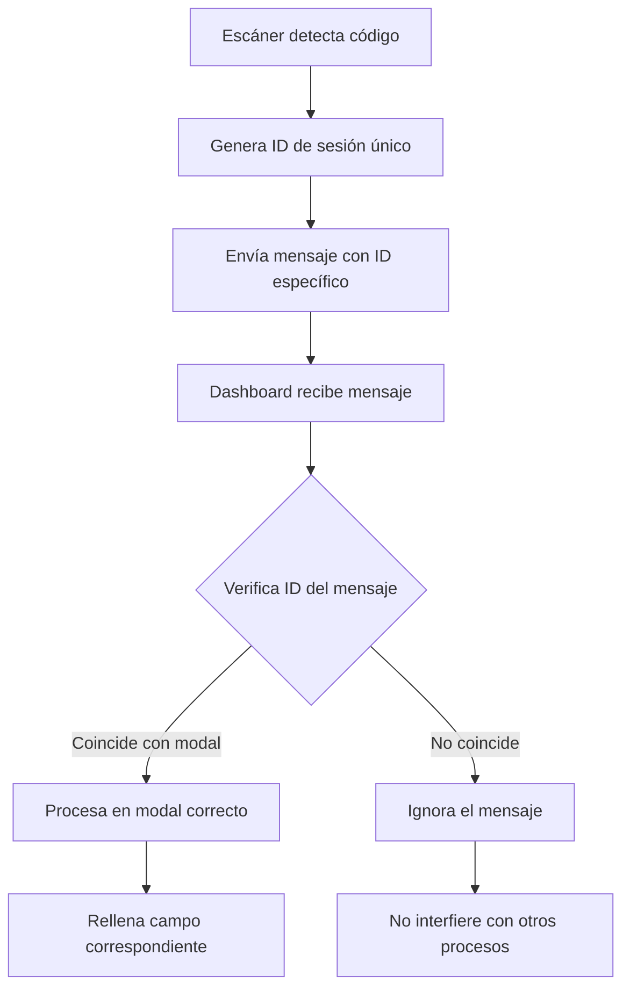

# Solución para el Conflicto de Sistemas de Escaneo

## 📋 Problema Identificado

### Descripción del Problema
El sistema POS presentaba conflictos entre múltiples sistemas de escaneo de códigos de barras, causando interferencias y fallos en la captura de códigos.

### Causas Raíz
1. **Múltiples listeners de `postMessage()`** sin identificación específica en [`dashboard.html`](frontend/dashboard.html:8211)
2. **Comunicación genérica** usando `window.opener.postMessage({ barcode: barcode }, '*')`
3. **Falta de validación** del origen y propósito del mensaje
4. **Interferencias cruzadas** entre diferentes modales de escaneo

### Síntomas
- Los códigos de barras se mezclaban entre diferentes modalidades de escaneo
- El código no se guardaba correctamente en el modal "Agregar nuevo producto"
- Necesidad de editar el producto y colocar el código nuevamente

## 🔧 Solución Implementada

### Arquitectura de la Solución



### Componentes de la Solución

#### 1. Sistema de Identificación de Sesiones (`frontend/scan-system-fix.js`)

**Funciones Principales:**
- `generateScanSessionId()`: Genera IDs únicos para cada sesión de escaneo
- `createScanMessageListener()`: Crea listeners con validación de sesión
- `processScannedBarcode()`: Procesa códigos con validación de formato
- `openScanWindow()`: Abre ventanas de escaneo con parámetros de sesión

**Características:**
- IDs únicos basados en timestamp y random
- Validación de formato EAN-8 y EAN-13
- Auto-limpieza de listeners después del uso
- Manejo de errores robusto

#### 2. Integración con barcode-scanner.html (`frontend/barcode-scanner-updated.js`)

**Funciones Principales:**
- `sendScannedBarcode()`: Envía códigos con identificación de sesión
- `updateScannerUIForSession()`: Muestra indicador de sesión activa
- `showScanConfirmation()`: Confirma visualmente el escaneo exitoso

**Características:**
- Detección automática de ID de sesión desde URL
- Validación de formato antes del envío
- Notificaciones visuales de éxito/error
- Cierre automático de ventana después del envío

#### 3. Funciones Específicas para Cada Modal

```javascript
// Modal de agregar producto
function openBarcodeScannerForAddProduct() {
    const sessionId = generateScanSessionId('add-product');
    const targetFieldId = 'addBarcode';
    openScanWindow(sessionId, targetFieldId, validateProductBarcode);
}

// Modal de editar producto  
function openBarcodeScannerForEditProduct() {
    const sessionId = generateScanSessionId('edit-product');
    const targetFieldId = 'editBarcode';
    openScanWindow(sessionId, targetFieldId);
}

// Modal de crear lote
function openBarcodeScannerForLote() {
    const sessionId = generateScanSessionId('create-lote');
    const targetFieldId = 'loteBarcode';
    openScanWindow(sessionId, targetFieldId, validateLoteBarcode);
}

// Modal de editar lote
function openBarcodeScannerForEditLote() {
    const sessionId = generateScanSessionId('edit-lote');
    const targetFieldId = 'editLoteBarcode';
    openScanWindow(sessionId, targetFieldId, validateEditLoteBarcode);
}
```

## 🚀 Beneficios de la Solución

### 1. Eliminación de Interferencias
- **Comunicación específica**: Cada modal tiene su propio canal de comunicación
- **Validación de origen**: Solo se procesan mensajes con el ID de sesión correcto
- **Aislamiento total**: Los sistemas de escaneo no interfieren entre sí

### 2. Mejora de la Confiabilidad
- **Validación de formato**: Se validan códigos EAN-8 y EAN-13 antes del procesamiento
- **Gestión de errores**: Manejo robusto de errores y mensajes inválidos
- **Auto-limpieza**: Los listeners se eliminan automáticamente después del uso

### 3. Experiencia de Usuario Mejorada
- **Confirmación visual**: Notificaciones claras de escaneo exitoso o fallido
- **Validación en tiempo real**: Advertencias sobre códigos ya existentes
- **Cierre automático**: Las ventanas de escaneo se cierran automáticamente

### 4. Mantenibilidad
- **Código modular**: Sistema fácil de extender para nuevos modales
- **Documentación clara**: Comentarios detallados y ejemplos de uso
- **Depuración mejorada**: Logs con IDs de sesión para seguimiento

## 📝 Implementación Paso a Paso

### Paso 1: Integrar el Sistema de Escaneo
1. Incluir el archivo `frontend/scan-system-fix.js` en el dashboard
2. Reemplazar las funciones de escaneo existentes con las nuevas funciones
3. Asegurar que los IDs de campos objetivo sean correctos

### Paso 2: Actualizar barcode-scanner.html
1. Incluir el archivo `frontend/barcode-scanner-updated.js`
2. Reemplazar la función `sendScannedBarcode()` existente
3. Probar la detección automática de IDs de sesión

### Paso 3: Pruebas de Validación
1. Probar cada modal de escaneo individualmente
2. Verificar que no haya interferencias entre modales
3. Validar la gestión de errores y mensajes

### Paso 4: Monitoreo y Ajustes
1. Monitorear logs para detectar posibles issues
2. Ajustar tiempos de cierre automático según necesidad
3. Extender validaciones según requerimientos específicos

## 🔍 Ejemplo de Uso

### Escaneo para Agregar Producto
```javascript
// 1. Usuario hace clic en "📱 Escanear" en el modal de agregar producto
// 2. Se genera un ID de sesión: "add-product-1704512345678-abc123"
// 3. Se abre barcode-scanner.html con ?session_id=add-product-1704512345678-abc123
// 4. Usuario escanea el código de barras
// 5. El código se envía con el ID de sesión: {type: 'barcode', session_id: 'add-product-1704512345678-abc123', barcode: '12345678'}
// 6. El listener en dashboard valida el ID y procesa el código
// 7. El código se coloca en el campo "addBarcode"
// 8. La ventana de escaneo se cierra automáticamente
```

## 🛠️ Consideraciones Técnicas

### Compatibilidad
- **Backward compatibility**: El sistema legacy sigue funcionando
- **Navegadores modernos**: Compatible con Chrome, Firefox, Safari, Edge
- **Mobile**: Funciona en dispositivos móviles con cámara

### Seguridad
- **Validación de origen**: Solo se aceptan mensajes de ventanas conocidas
- **Sanitización**: Validación de formato de códigos de barras
- **Limpieza**: Eliminación automática de listeners para evitar memory leaks

### Performance
- **Listeners eficientes**: Cada sesión tiene un solo listener activo
- **Auto-limpieza**: Liberación de recursos después del uso
- **Validación rápida**: Validaciones de formato en milisegundos

## 📊 Resultados Esperados

### Antes de la Solución
- ❌ Interferencias entre sistemas de escaneo
- ❌ Códigos que no se guardaban correctamente
- ❌ Necesidad de reingresar códigos manualmente
- ❌ Fallos aleatorios en la captura de códigos

### Después de la Solución
- ✅ Comunicación aislada entre modales
- ✅ Códigos que se guardan correctamente en el primer intento
- ✅ Proceso de escaneo confiable y consistente
- ✅ Experiencia de usuario mejorada

## 🔧 Mantenimiento Futuro

### Para Nuevos Modales de Escaneo
1. Crear una nueva función específica (ej: `openBarcodeScannerForNewModal()`)
2. Definir el ID del campo objetivo
3. Agregar validaciones específicas si son necesarias
4. Probar la integración con el sistema existente

### Para Mejoras de Validación
1. Extender las funciones de validación (`validateProductBarcode`, etc.)
2. Agregar nuevas reglas de negocio según requerimientos
3. Mejorar las notificaciones de usuario
4. Optimizar tiempos de respuesta

## 📞 Soporte Técnico

Para consultas sobre esta implementación:
- Revisar los logs en consola para IDs de sesión específicos
- Verificar que los IDs de campos objetivo sean correctos
- Probar cada modal de escaneo individualmente
- Contactar al equipo de desarrollo para issues complejos

---

**Versión:** 1.0  
**Fecha:** Enero 2026  
**Autor:** Sistema POS Development Team