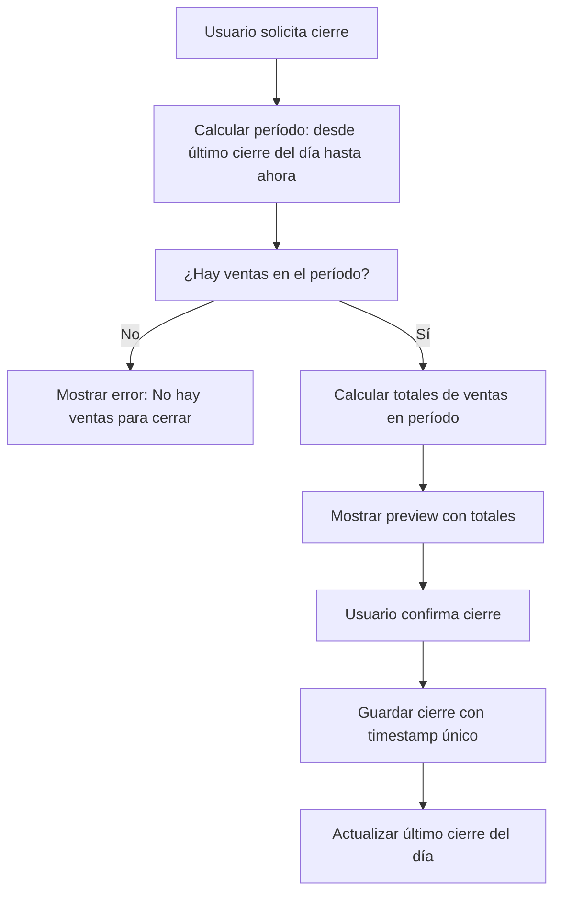

# Plan: Permitir Múltiples Cierres de Caja por Día

## Contexto Actual
Actualmente el sistema permite solo **un cierre de caja por fecha**, con restricción UNIQUE(fecha_cierre) en la tabla cierres_caja.

## Requerimiento
Permitir **múltiples cierres de caja al día**, siempre que cada cierre incluya al menos una venta en el período calculado.

## Cambios Necesarios

### 1. Modificación del Esquema de Base de Datos
- **Remover restricción UNIQUE(fecha_cierre)**
- **Agregar campo fecha_hora_cierre** para identificar cierres múltiples
- **Mantener fecha_cierre** para agrupación por día

### 2. Lógica de Cálculo de Ventas
**Antes:** Calculaba ventas solo por fecha específica
**Después:** Calcula ventas desde el último cierre del día hasta el momento actual

### 3. Validaciones
- **Eliminar validación** de cierre duplicado por fecha
- **Agregar validación** de que haya al menos una venta en el período

### 4. Interfaz de Usuario
- Mostrar múltiples cierres por día en el historial
- Indicar hora de cada cierre para diferenciarlos

## Diagrama de Flujo Nuevo

## Impacto en Funcionalidades Existentes
- ✅ Cierres retroactivos siguen funcionando
- ✅ Historial muestra todos los cierres
- ✅ Alertas de cierres pendientes se ajustan
- ✅ Reportes incluyen todos los cierres

## Consideraciones de Migración
- Cierres existentes permanecen válidos
- No se pierden datos históricos
- Sistema backward compatible