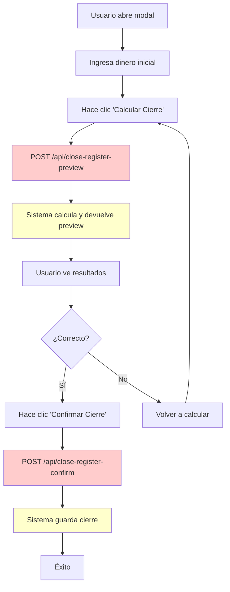
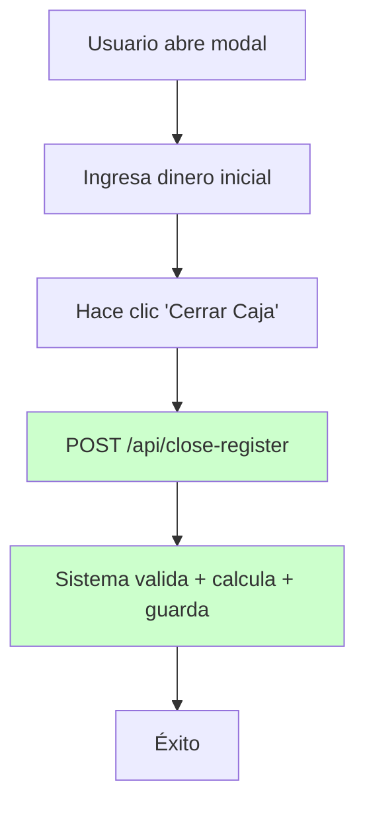
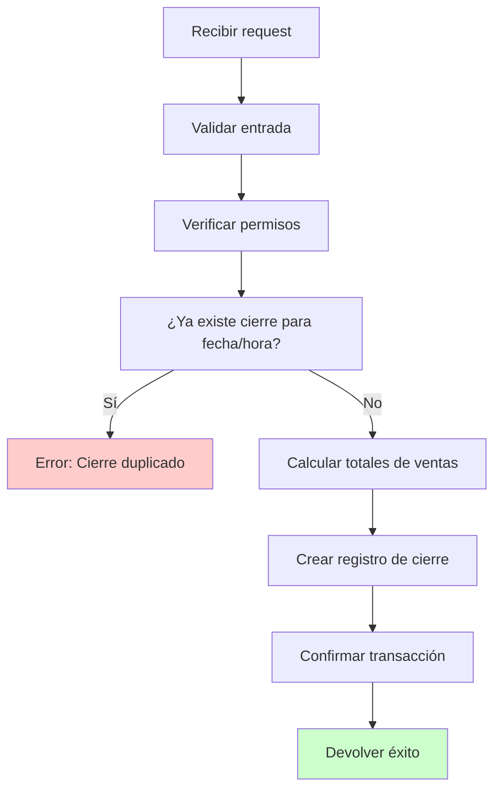

# Diagrama de Flujo: Cierre de Caja

## Flujo Actual (Problemático)

**Problemas del flujo actual:**
- 🔴 Dos endpoints separados
- 🔴 Estado temporal en frontend
- 🔴 Riesgo de pérdida de datos
- 🔴 Mayor complejidad

## Flujo Propuesto (Simplificado)

**Beneficios del flujo simplificado:**
- ✅ Un solo endpoint
- ✅ Transacción atómica
- ✅ Menos código
- ✅ Mejor UX
- ✅ Más confiable

## Validaciones del Nuevo Endpoint

¿Te gusta esta simplificación? Elimina la complejidad innecesaria y hace el proceso mucho más robusto.