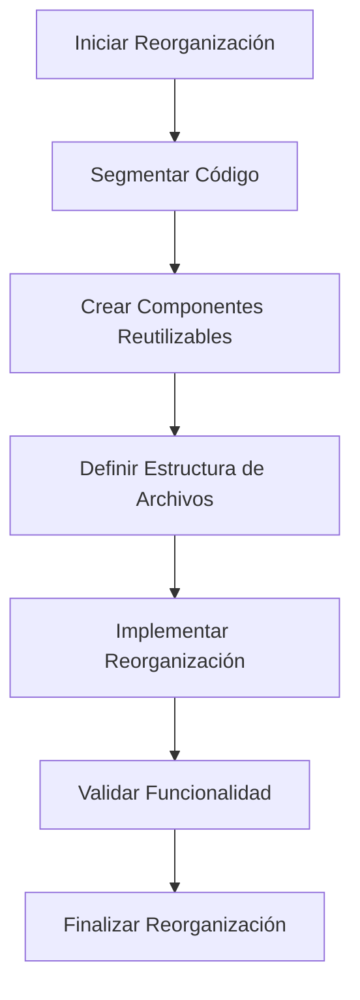

# Plan de Reorganización del Archivo dashboard.html

## Objetivo
Reorganizar y segmentar el código del archivo `dashboard.html` para mejorar su estructura, mantenimiento y escalabilidad.

## Análisis Inicial
El archivo `dashboard.html` contiene múltiples secciones críticas y componentes reutilizables que pueden ser segmentados en módulos lógicos. Las secciones identificadas incluyen:
- Navegación a módulos (Ventas, Promociones, Métricas, Productos, Lotes, Cierres, Proveedores, Operaciones).
- Buscador avanzado de productos.
- Listado de productos con detalles y promociones.
- Carrito de compras con métodos de pago.
- Sección de "Últimas Facturas".
- Módulo de "Alertas de Vencimiento".

## Pasos para la Reorganización

### 1. Segmentación del Código
- **HTML**: Separar la estructura HTML en componentes reutilizables.
- **CSS**: Extraer estilos a archivos externos y modularizarlos.
- **JavaScript**: Dividir la lógica en módulos independientes.

### 2. Creación de Componentes Reutilizables
- **Componentes Identificados**:
  - `Navbar`: Para la navegación entre módulos.
  - `ProductSearch`: Buscador avanzado de productos.
  - `ProductList`: Listado de productos con detalles.
  - `ShoppingCart`: Carrito de compras con métodos de pago.
  - `RecentInvoices`: Sección de últimas facturas.
  - `ExpiryAlerts`: Módulo de alertas de vencimiento.

### 3. Estructura de Archivos Propuesta
```
frontend/
├── components/
│   ├── navbar.html
│   ├── product-search.html
│   ├── product-list.html
│   ├── shopping-cart.html
│   ├── recent-invoices.html
│   └── expiry-alerts.html
├── css/
│   ├── main.css
│   ├── components.css
│   └── responsive.css
├── js/
│   ├── main.js
│   ├── components.js
│   └── utils.js
└── dashboard.html
```

### 4. Implementación de la Reorganización
- **HTML**: Reemplazar secciones estáticas con includes de componentes.
- **CSS**: Vincular archivos CSS externos en el `dashboard.html`.
- **JavaScript**: Importar módulos JS según sea necesario.

### 5. Validación de Funcionalidad
- Probar cada componente individualmente.
- Verificar la integración de todos los componentes en el `dashboard.html`.
- Asegurar que no haya regresiones en la funcionalidad existente.

## Diagrama de Flujo


## Próximos Pasos
1. Implementar la reorganización del código.
2. Validar la funcionalidad después de la reorganización.

## Notas Adicionales
- Mantener coherencia con el contexto actual del POS.
- Asegurar que los cambios no afecten la lógica de negocio existente.
- Documentar cualquier suposición realizada durante el proceso.