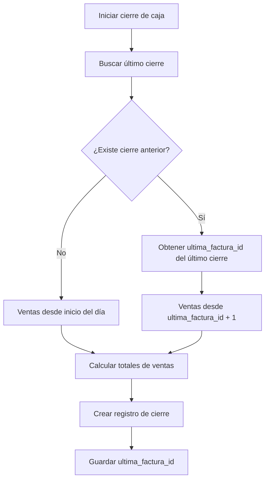

# Sistema de Tracking de Facturas para Cierres de Caja

## Problema Identificado
El sistema permite **múltiples cierres de caja que incluyen las mismas ventas**, causando:
- 🔴 Duplicación de ingresos reportados
- 🔴 Inconsistencias financieras
- 🔴 Dificultad para auditar

## Solución: Tracking de Última Factura

### Nuevo Campo en `cierres_caja`
```sql
ALTER TABLE cierres_caja ADD COLUMN ultima_factura_id INTEGER REFERENCES ventas(id);
```

### Lógica de Cálculo de Ventas

#### Cierre #1 (Primer cierre del día)
```
Ventas desde: inicio del día
Ventas hasta: última venta del día
Guarda: ultima_factura_id = ID de la última venta incluida
```

#### Cierre #2 (Segundo cierre del día)
```
Ventas desde: ultima_factura_id del cierre anterior + 1
Ventas hasta: última venta actual
Guarda: ultima_factura_id = ID de la última venta incluida
```

### Diagrama de Lógica


### Validaciones Implementadas
- ✅ **No ventas duplicadas**: Cada venta solo se incluye en un cierre
- ✅ **Secuencialidad**: Los cierres procesan ventas en orden de ID
- ✅ **Consistencia**: Los totales son siempre precisos
- ✅ **Auditabilidad**: Se puede rastrear qué ventas están en cada cierre

### Ejemplo Práctico

#### Base de datos inicial
```
ventas:
ID | numero_factura | total | created_at
1  | FAC-001        | 100   | 2024-01-01 10:00
2  | FAC-002        | 150   | 2024-01-01 11:00
3  | FAC-003        | 200   | 2024-01-01 12:00
4  | FAC-004        | 50    | 2024-01-01 13:00
```

#### Primer cierre (10:00-12:00)
```sql
-- Incluye ventas hasta ID 3 (FAC-003)
INSERT INTO cierres_caja (..., ultima_factura_id) VALUES (..., 3);
-- Total: 100 + 150 + 200 = 450
```

#### Segundo cierre (12:00-14:00)
```sql
-- Incluye ventas desde ID 4 en adelante
SELECT * FROM ventas WHERE id > 3 AND DATE(created_at) = '2024-01-01'
-- Resultado: FAC-004 (50)
-- Total: 50
```

### Beneficios
- 🔒 **Prevención de duplicados**: Imposible incluir la misma venta en múltiples cierres
- 📊 **Reportes precisos**: Cada cierre refleja ventas reales del período
- 🔍 **Auditoría clara**: Se puede verificar qué ventas están en cada cierre
- ⚡ **Rendimiento**: No requiere cambios complejos en la estructura

### Implementación Backend
1. Agregar campo `ultima_factura_id` a tabla `cierres_caja`
2. Modificar query de cálculo de ventas para usar `WHERE id > ultima_factura_id_del_ultimo_cierre`
3. Guardar `ultima_factura_id` al crear cada cierre
4. Agregar validación: si no hay ventas nuevas, mostrar advertencia

¿Te parece correcta esta lógica? Soluciona el problema de raíz sin complicar innecesariamente el sistema.